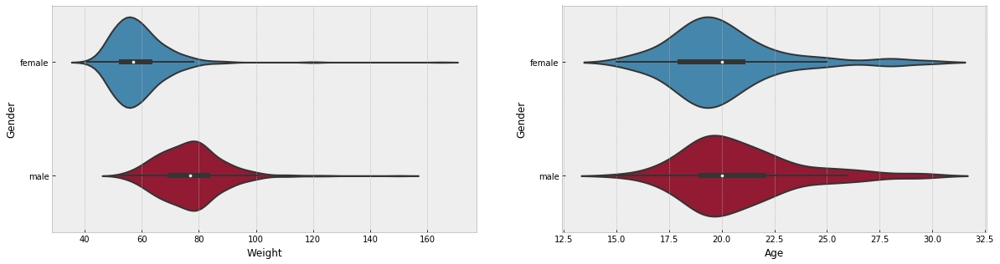
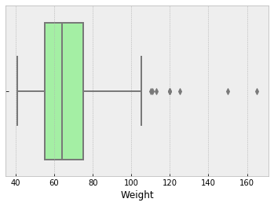
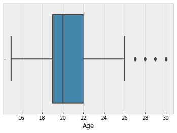
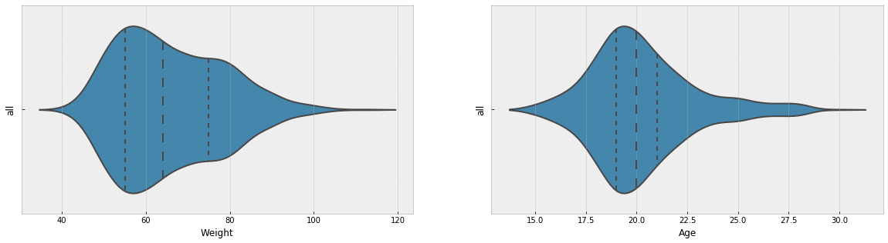
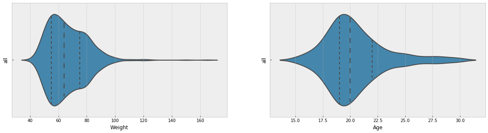
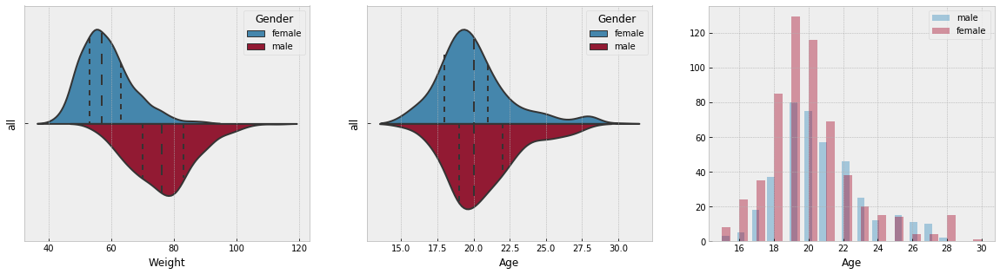

<center>
<h4>Diplomatura AACSyA 2018 - FaMAF - UNC</h4>
<h3>Análisis y visualización de datos</h3>
</center>

# Laboratorio 1


```python
%matplotlib inline
import pandas as pd
import copy
import matplotlib.pyplot as plt
import numpy as np
import seaborn as sns
#import corrplot

# styling
pd.set_option('display.max_columns',150)
plt.style.use('bmh')
from IPython.display import display

import warnings
warnings.filterwarnings("ignore")
```


```python
young = pd.read_csv('./responses.csv')
```


```python
young.head(2)
```


<div>
<style scoped>
    .dataframe tbody tr th:only-of-type {
        vertical-align: middle;
    }

    .dataframe tbody tr th {
        vertical-align: top;
    }

    .dataframe thead th {
        text-align: right;
    }
</style>
<table border="1" class="dataframe">
  <thead>
    <tr style="text-align: right;">
      <th></th>
      <th>Music</th>
      <th>Slow songs or fast songs</th>
      <th>Dance</th>
      <th>Folk</th>
      <th>Country</th>
      <th>Classical music</th>
      <th>Musical</th>
      <th>Pop</th>
      <th>Rock</th>
      <th>Metal or Hardrock</th>
      <th>Punk</th>
      <th>Hiphop, Rap</th>
      <th>Reggae, Ska</th>
      <th>Swing, Jazz</th>
      <th>Rock n roll</th>
      <th>Alternative</th>
      <th>Latino</th>
      <th>Techno, Trance</th>
      <th>Opera</th>
      <th>Movies</th>
      <th>Horror</th>
      <th>Thriller</th>
      <th>Comedy</th>
      <th>Romantic</th>
      <th>Sci-fi</th>
      <th>War</th>
      <th>Fantasy/Fairy tales</th>
      <th>Animated</th>
      <th>Documentary</th>
      <th>Western</th>
      <th>Action</th>
      <th>History</th>
      <th>Psychology</th>
      <th>Politics</th>
      <th>Mathematics</th>
      <th>Physics</th>
      <th>Internet</th>
      <th>PC</th>
      <th>Economy Management</th>
      <th>Biology</th>
      <th>Chemistry</th>
      <th>Reading</th>
      <th>Geography</th>
      <th>Foreign languages</th>
      <th>Medicine</th>
      <th>Law</th>
      <th>Cars</th>
      <th>Art exhibitions</th>
      <th>Religion</th>
      <th>Countryside, outdoors</th>
      <th>Dancing</th>
      <th>Musical instruments</th>
      <th>Writing</th>
      <th>Passive sport</th>
      <th>Active sport</th>
      <th>Gardening</th>
      <th>Celebrities</th>
      <th>Shopping</th>
      <th>Science and technology</th>
      <th>Theatre</th>
      <th>Fun with friends</th>
      <th>Adrenaline sports</th>
      <th>Pets</th>
      <th>Flying</th>
      <th>Storm</th>
      <th>Darkness</th>
      <th>Heights</th>
      <th>Spiders</th>
      <th>Snakes</th>
      <th>Rats</th>
      <th>Ageing</th>
      <th>Dangerous dogs</th>
      <th>Fear of public speaking</th>
      <th>Smoking</th>
      <th>Alcohol</th>
      <th>Healthy eating</th>
      <th>Daily events</th>
      <th>Prioritising workload</th>
      <th>Writing notes</th>
      <th>Workaholism</th>
      <th>Thinking ahead</th>
      <th>Final judgement</th>
      <th>Reliability</th>
      <th>Keeping promises</th>
      <th>Loss of interest</th>
      <th>Friends versus money</th>
      <th>Funniness</th>
      <th>Fake</th>
      <th>Criminal damage</th>
      <th>Decision making</th>
      <th>Elections</th>
      <th>Self-criticism</th>
      <th>Judgment calls</th>
      <th>Hypochondria</th>
      <th>Empathy</th>
      <th>Eating to survive</th>
      <th>Giving</th>
      <th>Compassion to animals</th>
      <th>Borrowed stuff</th>
      <th>Loneliness</th>
      <th>Cheating in school</th>
      <th>Health</th>
      <th>Changing the past</th>
      <th>God</th>
      <th>Dreams</th>
      <th>Charity</th>
      <th>Number of friends</th>
      <th>Punctuality</th>
      <th>Lying</th>
      <th>Waiting</th>
      <th>New environment</th>
      <th>Mood swings</th>
      <th>Appearence and gestures</th>
      <th>Socializing</th>
      <th>Achievements</th>
      <th>Responding to a serious letter</th>
      <th>Children</th>
      <th>Assertiveness</th>
      <th>Getting angry</th>
      <th>Knowing the right people</th>
      <th>Public speaking</th>
      <th>Unpopularity</th>
      <th>Life struggles</th>
      <th>Happiness in life</th>
      <th>Energy levels</th>
      <th>Small - big dogs</th>
      <th>Personality</th>
      <th>Finding lost valuables</th>
      <th>Getting up</th>
      <th>Interests or hobbies</th>
      <th>Parents' advice</th>
      <th>Questionnaires or polls</th>
      <th>Internet usage</th>
      <th>Finances</th>
      <th>Shopping centres</th>
      <th>Branded clothing</th>
      <th>Entertainment spending</th>
      <th>Spending on looks</th>
      <th>Spending on gadgets</th>
      <th>Spending on healthy eating</th>
      <th>Age</th>
      <th>Height</th>
      <th>Weight</th>
      <th>Number of siblings</th>
      <th>Gender</th>
      <th>Left - right handed</th>
      <th>Education</th>
      <th>Only child</th>
      <th>Village - town</th>
      <th>House - block of flats</th>
    </tr>
  </thead>
  <tbody>
    <tr>
      <th>0</th>
      <td>5.0</td>
      <td>3.0</td>
      <td>2.0</td>
      <td>1.0</td>
      <td>2.0</td>
      <td>2.0</td>
      <td>1.0</td>
      <td>5.0</td>
      <td>5.0</td>
      <td>1.0</td>
      <td>1.0</td>
      <td>1.0</td>
      <td>1.0</td>
      <td>1.0</td>
      <td>3.0</td>
      <td>1.0</td>
      <td>1.0</td>
      <td>1.0</td>
      <td>1.0</td>
      <td>5.0</td>
      <td>4.0</td>
      <td>2.0</td>
      <td>5.0</td>
      <td>4.0</td>
      <td>4.0</td>
      <td>1.0</td>
      <td>5.0</td>
      <td>5.0</td>
      <td>3.0</td>
      <td>1.0</td>
      <td>2.0</td>
      <td>1.0</td>
      <td>5.0</td>
      <td>1.0</td>
      <td>3.0</td>
      <td>3.0</td>
      <td>5.0</td>
      <td>3.0</td>
      <td>5.0</td>
      <td>3.0</td>
      <td>3.0</td>
      <td>3.0</td>
      <td>3.0</td>
      <td>5.0</td>
      <td>3.0</td>
      <td>1.0</td>
      <td>1.0</td>
      <td>1.0</td>
      <td>1.0</td>
      <td>5.0</td>
      <td>3.0</td>
      <td>3.0</td>
      <td>2.0</td>
      <td>1.0</td>
      <td>5.0</td>
      <td>5.0</td>
      <td>1.0</td>
      <td>4.0</td>
      <td>4.0</td>
      <td>2.0</td>
      <td>5.0</td>
      <td>4.0</td>
      <td>4.0</td>
      <td>1.0</td>
      <td>1.0</td>
      <td>1.0</td>
      <td>1.0</td>
      <td>1.0</td>
      <td>5</td>
      <td>3.0</td>
      <td>1.0</td>
      <td>3.0</td>
      <td>2.0</td>
      <td>never smoked</td>
      <td>drink a lot</td>
      <td>4.0</td>
      <td>2.0</td>
      <td>2.0</td>
      <td>5.0</td>
      <td>4.0</td>
      <td>2.0</td>
      <td>5.0</td>
      <td>4.0</td>
      <td>4.0</td>
      <td>1.0</td>
      <td>3.0</td>
      <td>5.0</td>
      <td>1.0</td>
      <td>1.0</td>
      <td>3.0</td>
      <td>4.0</td>
      <td>1.0</td>
      <td>3.0</td>
      <td>1.0</td>
      <td>3.0</td>
      <td>1</td>
      <td>4.0</td>
      <td>5.0</td>
      <td>4.0</td>
      <td>3.0</td>
      <td>2.0</td>
      <td>1.0</td>
      <td>1.0</td>
      <td>1.0</td>
      <td>4</td>
      <td>2.0</td>
      <td>3</td>
      <td>i am always on time</td>
      <td>never</td>
      <td>3.0</td>
      <td>4.0</td>
      <td>3.0</td>
      <td>4.0</td>
      <td>3.0</td>
      <td>4.0</td>
      <td>3.0</td>
      <td>5.0</td>
      <td>1.0</td>
      <td>1.0</td>
      <td>3.0</td>
      <td>5.0</td>
      <td>5.0</td>
      <td>1.0</td>
      <td>4.0</td>
      <td>5.0</td>
      <td>1.0</td>
      <td>4.0</td>
      <td>3.0</td>
      <td>2.0</td>
      <td>3.0</td>
      <td>4.0</td>
      <td>3.0</td>
      <td>few hours a day</td>
      <td>3.0</td>
      <td>4.0</td>
      <td>5.0</td>
      <td>3.0</td>
      <td>3.0</td>
      <td>1</td>
      <td>3.0</td>
      <td>20.0</td>
      <td>163.0</td>
      <td>48.0</td>
      <td>1.0</td>
      <td>female</td>
      <td>right handed</td>
      <td>college/bachelor degree</td>
      <td>no</td>
      <td>village</td>
      <td>block of flats</td>
    </tr>
    <tr>
      <th>1</th>
      <td>4.0</td>
      <td>4.0</td>
      <td>2.0</td>
      <td>1.0</td>
      <td>1.0</td>
      <td>1.0</td>
      <td>2.0</td>
      <td>3.0</td>
      <td>5.0</td>
      <td>4.0</td>
      <td>4.0</td>
      <td>1.0</td>
      <td>3.0</td>
      <td>1.0</td>
      <td>4.0</td>
      <td>4.0</td>
      <td>2.0</td>
      <td>1.0</td>
      <td>1.0</td>
      <td>5.0</td>
      <td>2.0</td>
      <td>2.0</td>
      <td>4.0</td>
      <td>3.0</td>
      <td>4.0</td>
      <td>1.0</td>
      <td>3.0</td>
      <td>5.0</td>
      <td>4.0</td>
      <td>1.0</td>
      <td>4.0</td>
      <td>1.0</td>
      <td>3.0</td>
      <td>4.0</td>
      <td>5.0</td>
      <td>2.0</td>
      <td>4.0</td>
      <td>4.0</td>
      <td>5.0</td>
      <td>1.0</td>
      <td>1.0</td>
      <td>4.0</td>
      <td>4.0</td>
      <td>5.0</td>
      <td>1.0</td>
      <td>2.0</td>
      <td>2.0</td>
      <td>2.0</td>
      <td>1.0</td>
      <td>1.0</td>
      <td>1.0</td>
      <td>1.0</td>
      <td>1.0</td>
      <td>1.0</td>
      <td>1.0</td>
      <td>1.0</td>
      <td>2.0</td>
      <td>3.0</td>
      <td>3.0</td>
      <td>2.0</td>
      <td>4.0</td>
      <td>2.0</td>
      <td>5.0</td>
      <td>1.0</td>
      <td>1.0</td>
      <td>1.0</td>
      <td>2.0</td>
      <td>1.0</td>
      <td>1</td>
      <td>1.0</td>
      <td>3.0</td>
      <td>1.0</td>
      <td>4.0</td>
      <td>never smoked</td>
      <td>drink a lot</td>
      <td>3.0</td>
      <td>3.0</td>
      <td>2.0</td>
      <td>4.0</td>
      <td>5.0</td>
      <td>4.0</td>
      <td>1.0</td>
      <td>4.0</td>
      <td>4.0</td>
      <td>3.0</td>
      <td>4.0</td>
      <td>3.0</td>
      <td>2.0</td>
      <td>1.0</td>
      <td>2.0</td>
      <td>5.0</td>
      <td>4.0</td>
      <td>4.0</td>
      <td>1.0</td>
      <td>2.0</td>
      <td>1</td>
      <td>2.0</td>
      <td>4.0</td>
      <td>3.0</td>
      <td>2.0</td>
      <td>4.0</td>
      <td>4.0</td>
      <td>4.0</td>
      <td>1.0</td>
      <td>3</td>
      <td>1.0</td>
      <td>3</td>
      <td>i am often early</td>
      <td>sometimes</td>
      <td>3.0</td>
      <td>4.0</td>
      <td>4.0</td>
      <td>4.0</td>
      <td>4.0</td>
      <td>2.0</td>
      <td>4.0</td>
      <td>2.0</td>
      <td>2.0</td>
      <td>5.0</td>
      <td>4.0</td>
      <td>4.0</td>
      <td>4.0</td>
      <td>1.0</td>
      <td>4.0</td>
      <td>3.0</td>
      <td>5.0</td>
      <td>3.0</td>
      <td>4.0</td>
      <td>5.0</td>
      <td>3.0</td>
      <td>2.0</td>
      <td>3.0</td>
      <td>few hours a day</td>
      <td>3.0</td>
      <td>4.0</td>
      <td>1.0</td>
      <td>4.0</td>
      <td>2.0</td>
      <td>5</td>
      <td>2.0</td>
      <td>19.0</td>
      <td>163.0</td>
      <td>58.0</td>
      <td>2.0</td>
      <td>female</td>
      <td>right handed</td>
      <td>college/bachelor degree</td>
      <td>no</td>
      <td>city</td>
      <td>block of flats</td>
    </tr>
  </tbody>
</table>
</div>


```python
young[["Weight", "Age"]].describe()
```


<div>
<style scoped>
    .dataframe tbody tr th:only-of-type {
        vertical-align: middle;
    }

    .dataframe tbody tr th {
        vertical-align: top;
    }

    .dataframe thead th {
        text-align: right;
    }
</style>
<table border="1" class="dataframe">
  <thead>
    <tr style="text-align: right;">
      <th></th>
      <th>Weight</th>
      <th>Age</th>
    </tr>
  </thead>
  <tbody>
    <tr>
      <th>count</th>
      <td>964.000000</td>
      <td>977.000000</td>
    </tr>
    <tr>
      <th>mean</th>
      <td>65.800830</td>
      <td>20.240532</td>
    </tr>
    <tr>
      <th>std</th>
      <td>12.592246</td>
      <td>2.545583</td>
    </tr>
    <tr>
      <th>min</th>
      <td>41.000000</td>
      <td>15.000000</td>
    </tr>
    <tr>
      <th>25%</th>
      <td>55.000000</td>
      <td>19.000000</td>
    </tr>
    <tr>
      <th>50%</th>
      <td>64.000000</td>
      <td>20.000000</td>
    </tr>
    <tr>
      <th>75%</th>
      <td>75.000000</td>
      <td>21.000000</td>
    </tr>
    <tr>
      <th>max</th>
      <td>113.000000</td>
      <td>30.000000</td>
    </tr>
  </tbody>
</table>
</div>


```python
young[["Weight", "Age"]].mean()
```


    Weight    66.405051
    Age       20.433699
    dtype: float64


```python
young[["Weight", "Age"]].median()
```


    Weight    64.0
    Age       20.0
    dtype: float64


```python
young[["Weight", "Age"]].mode()
```


<div>
<style scoped>
    .dataframe tbody tr th:only-of-type {
        vertical-align: middle;
    }

    .dataframe tbody tr th {
        vertical-align: top;
    }

    .dataframe thead th {
        text-align: right;
    }
</style>
<table border="1" class="dataframe">
  <thead>
    <tr style="text-align: right;">
      <th></th>
      <th>Weight</th>
      <th>Age</th>
    </tr>
  </thead>
  <tbody>
    <tr>
      <th>0</th>
      <td>60.0</td>
      <td>19.0</td>
    </tr>
  </tbody>
</table>
</div>


```python
young[["Weight", "Age"]].std()
```


    Weight    13.839561
    Age        2.828840
    dtype: float64


```python
young["all"] = ""
```


```python
fig, ax = plt.subplots(nrows=1, ncols=2, figsize=(20,5))
data = young.dropna(subset=['Weight','Gender'])
_ = sns.violinplot(x='Weight', y='Gender', data=data, split=True, ax = ax[0],)
data = young.dropna(subset=['Age'])
_ = sns.violinplot(x='Age', y='Gender', data=data, split=True, ax = ax[1])
```





A partir de los gráficos presentados puede considerarse que los mismo corresponde a una distribución normal con diferencia notable en la media para cada uno de los géneros en el caso del peso donde la media en los hombres es mayor que la mujeres pero manteniendo una distribución normal. Por otra parte en la edad hay un comportamiento similar en cuanto forma de la distribución a pesar que la poblaciones son distintas en número existe un proporcionalidad similar.


```python
sns.boxplot(young["Weight"],
            color="PaleGreen")
```


    <matplotlib.axes._subplots.AxesSubplot at 0x7fb5b0d96b70>





```python
sns.boxplot(young["Age"])
```


    <matplotlib.axes._subplots.AxesSubplot at 0x7fb58633f5c0>





```python
df = young[["Weight", "Age"]]
df[~(np.abs(df[["Weight", "Age"]]-df[["Weight", "Age"]].mean())<=(3*df[["Weight", "Age"]].std()))].dropna(thresh=1)
```


<div>
<style scoped>
    .dataframe tbody tr th:only-of-type {
        vertical-align: middle;
    }

    .dataframe tbody tr th {
        vertical-align: top;
    }

    .dataframe thead th {
        text-align: right;
    }
</style>
<table border="1" class="dataframe">
  <thead>
    <tr style="text-align: right;">
      <th></th>
      <th>Weight</th>
      <th>Age</th>
    </tr>
  </thead>
  <tbody>
    <tr>
      <th>186</th>
      <td>NaN</td>
      <td>29.0</td>
    </tr>
    <tr>
      <th>191</th>
      <td>NaN</td>
      <td>29.0</td>
    </tr>
    <tr>
      <th>221</th>
      <td>NaN</td>
      <td>30.0</td>
    </tr>
    <tr>
      <th>292</th>
      <td>120.0</td>
      <td>NaN</td>
    </tr>
    <tr>
      <th>343</th>
      <td>NaN</td>
      <td>29.0</td>
    </tr>
    <tr>
      <th>392</th>
      <td>NaN</td>
      <td>30.0</td>
    </tr>
    <tr>
      <th>461</th>
      <td>NaN</td>
      <td>29.0</td>
    </tr>
    <tr>
      <th>473</th>
      <td>NaN</td>
      <td>29.0</td>
    </tr>
    <tr>
      <th>478</th>
      <td>NaN</td>
      <td>30.0</td>
    </tr>
    <tr>
      <th>542</th>
      <td>NaN</td>
      <td>29.0</td>
    </tr>
    <tr>
      <th>612</th>
      <td>110.0</td>
      <td>NaN</td>
    </tr>
    <tr>
      <th>637</th>
      <td>NaN</td>
      <td>29.0</td>
    </tr>
    <tr>
      <th>683</th>
      <td>NaN</td>
      <td>30.0</td>
    </tr>
    <tr>
      <th>715</th>
      <td>111.0</td>
      <td>29.0</td>
    </tr>
    <tr>
      <th>716</th>
      <td>NaN</td>
      <td>29.0</td>
    </tr>
    <tr>
      <th>793</th>
      <td>120.0</td>
      <td>NaN</td>
    </tr>
    <tr>
      <th>795</th>
      <td>NaN</td>
      <td>30.0</td>
    </tr>
    <tr>
      <th>796</th>
      <td>113.0</td>
      <td>NaN</td>
    </tr>
    <tr>
      <th>801</th>
      <td>NaN</td>
      <td>30.0</td>
    </tr>
    <tr>
      <th>824</th>
      <td>NaN</td>
      <td>29.0</td>
    </tr>
    <tr>
      <th>844</th>
      <td>NaN</td>
      <td>30.0</td>
    </tr>
    <tr>
      <th>853</th>
      <td>NaN</td>
      <td>30.0</td>
    </tr>
    <tr>
      <th>859</th>
      <td>125.0</td>
      <td>NaN</td>
    </tr>
    <tr>
      <th>885</th>
      <td>165.0</td>
      <td>NaN</td>
    </tr>
    <tr>
      <th>973</th>
      <td>120.0</td>
      <td>NaN</td>
    </tr>
    <tr>
      <th>989</th>
      <td>NaN</td>
      <td>30.0</td>
    </tr>
    <tr>
      <th>990</th>
      <td>NaN</td>
      <td>29.0</td>
    </tr>
    <tr>
      <th>992</th>
      <td>150.0</td>
      <td>30.0</td>
    </tr>
  </tbody>
</table>
</div>


```python
young.drop([186,191,221,292,343,392,461,473,478,542,612,637,683,715,716,793,801,824,844,853,859,885,973,989,990,992], inplace = True)
```


```python
fig, ax = plt.subplots(nrows=1, ncols=2, figsize=(20,5))
data = young.dropna(subset=['Weight'])
_ = sns.violinplot(x='Weight', y='all', data=data, split=True, ax = ax[0], inner = 'quartile')
data = young.dropna(subset=['Age'])
_ = sns.violinplot(x='Age', y='all', data=data, split=True, ax = ax[1], inner = 'quartile')
```





```python
fig, ax = plt.subplots(nrows=1, ncols=2, figsize=(20,5))
data = young.dropna(subset=['Weight'])
_ = sns.violinplot(x='Weight', y='all', data=data, split=True, ax = ax[0], inner = 'quartile')
data = young.dropna(subset=['Age'])
_ = sns.violinplot(x='Age', y='all', data=data, split=True, ax = ax[1], inner = 'quartile')
```





```python
young[young['Gender'] == 'male'].describe()
```


<div>
<style scoped>
    .dataframe tbody tr th:only-of-type {
        vertical-align: middle;
    }

    .dataframe tbody tr th {
        vertical-align: top;
    }

    .dataframe thead th {
        text-align: right;
    }
</style>
<table border="1" class="dataframe">
  <thead>
    <tr style="text-align: right;">
      <th></th>
      <th>Music</th>
      <th>Slow songs or fast songs</th>
      <th>Dance</th>
      <th>Folk</th>
      <th>Country</th>
      <th>Classical music</th>
      <th>Musical</th>
      <th>Pop</th>
      <th>Rock</th>
      <th>Metal or Hardrock</th>
      <th>Punk</th>
      <th>Hiphop, Rap</th>
      <th>Reggae, Ska</th>
      <th>Swing, Jazz</th>
      <th>Rock n roll</th>
      <th>Alternative</th>
      <th>Latino</th>
      <th>Techno, Trance</th>
      <th>Opera</th>
      <th>Movies</th>
      <th>Horror</th>
      <th>Thriller</th>
      <th>Comedy</th>
      <th>Romantic</th>
      <th>Sci-fi</th>
      <th>War</th>
      <th>Fantasy/Fairy tales</th>
      <th>Animated</th>
      <th>Documentary</th>
      <th>Western</th>
      <th>Action</th>
      <th>History</th>
      <th>Psychology</th>
      <th>Politics</th>
      <th>Mathematics</th>
      <th>Physics</th>
      <th>Internet</th>
      <th>PC</th>
      <th>Economy Management</th>
      <th>Biology</th>
      <th>Chemistry</th>
      <th>Reading</th>
      <th>Geography</th>
      <th>Foreign languages</th>
      <th>Medicine</th>
      <th>Law</th>
      <th>Cars</th>
      <th>Art exhibitions</th>
      <th>Religion</th>
      <th>Countryside, outdoors</th>
      <th>Dancing</th>
      <th>Musical instruments</th>
      <th>Writing</th>
      <th>Passive sport</th>
      <th>Active sport</th>
      <th>Gardening</th>
      <th>Celebrities</th>
      <th>Shopping</th>
      <th>Science and technology</th>
      <th>Theatre</th>
      <th>Fun with friends</th>
      <th>Adrenaline sports</th>
      <th>Pets</th>
      <th>Flying</th>
      <th>Storm</th>
      <th>Darkness</th>
      <th>Heights</th>
      <th>Spiders</th>
      <th>Snakes</th>
      <th>Rats</th>
      <th>Ageing</th>
      <th>Dangerous dogs</th>
      <th>Fear of public speaking</th>
      <th>Healthy eating</th>
      <th>Daily events</th>
      <th>Prioritising workload</th>
      <th>Writing notes</th>
      <th>Workaholism</th>
      <th>Thinking ahead</th>
      <th>Final judgement</th>
      <th>Reliability</th>
      <th>Keeping promises</th>
      <th>Loss of interest</th>
      <th>Friends versus money</th>
      <th>Funniness</th>
      <th>Fake</th>
      <th>Criminal damage</th>
      <th>Decision making</th>
      <th>Elections</th>
      <th>Self-criticism</th>
      <th>Judgment calls</th>
      <th>Hypochondria</th>
      <th>Empathy</th>
      <th>Eating to survive</th>
      <th>Giving</th>
      <th>Compassion to animals</th>
      <th>Borrowed stuff</th>
      <th>Loneliness</th>
      <th>Cheating in school</th>
      <th>Health</th>
      <th>Changing the past</th>
      <th>God</th>
      <th>Dreams</th>
      <th>Charity</th>
      <th>Number of friends</th>
      <th>Waiting</th>
      <th>New environment</th>
      <th>Mood swings</th>
      <th>Appearence and gestures</th>
      <th>Socializing</th>
      <th>Achievements</th>
      <th>Responding to a serious letter</th>
      <th>Children</th>
      <th>Assertiveness</th>
      <th>Getting angry</th>
      <th>Knowing the right people</th>
      <th>Public speaking</th>
      <th>Unpopularity</th>
      <th>Life struggles</th>
      <th>Happiness in life</th>
      <th>Energy levels</th>
      <th>Small - big dogs</th>
      <th>Personality</th>
      <th>Finding lost valuables</th>
      <th>Getting up</th>
      <th>Interests or hobbies</th>
      <th>Parents' advice</th>
      <th>Questionnaires or polls</th>
      <th>Finances</th>
      <th>Shopping centres</th>
      <th>Branded clothing</th>
      <th>Entertainment spending</th>
      <th>Spending on looks</th>
      <th>Spending on gadgets</th>
      <th>Spending on healthy eating</th>
      <th>Age</th>
      <th>Height</th>
      <th>Weight</th>
      <th>Number of siblings</th>
    </tr>
  </thead>
  <tbody>
    <tr>
      <th>count</th>
      <td>398.000000</td>
      <td>398.000000</td>
      <td>396.000000</td>
      <td>395.000000</td>
      <td>394.000000</td>
      <td>394.000000</td>
      <td>397.000000</td>
      <td>395.000000</td>
      <td>396.000000</td>
      <td>397.000000</td>
      <td>393.000000</td>
      <td>397.000000</td>
      <td>395.000000</td>
      <td>397.000000</td>
      <td>398.000000</td>
      <td>397.000000</td>
      <td>393.000000</td>
      <td>394.000000</td>
      <td>398.000000</td>
      <td>396.000000</td>
      <td>397.000000</td>
      <td>398.000000</td>
      <td>396.000000</td>
      <td>396.000000</td>
      <td>398.000000</td>
      <td>397.000000</td>
      <td>395.000000</td>
      <td>397.000000</td>
      <td>394.000000</td>
      <td>394.000000</td>
      <td>398.000000</td>
      <td>398.000000</td>
      <td>396.000000</td>
      <td>398.000000</td>
      <td>396.000000</td>
      <td>398.00000</td>
      <td>397.000000</td>
      <td>397.000000</td>
      <td>395.000000</td>
      <td>394.000000</td>
      <td>392.000000</td>
      <td>396.000000</td>
      <td>393.000000</td>
      <td>394.000000</td>
      <td>396.000000</td>
      <td>397.000000</td>
      <td>398.000000</td>
      <td>397.000000</td>
      <td>396.000000</td>
      <td>394.000000</td>
      <td>397.000000</td>
      <td>397.000000</td>
      <td>394.000000</td>
      <td>394.000000</td>
      <td>396.000000</td>
      <td>397.000000</td>
      <td>398.000000</td>
      <td>397.000000</td>
      <td>397.000000</td>
      <td>395.000000</td>
      <td>398.000000</td>
      <td>396.000000</td>
      <td>396.000000</td>
      <td>396.000000</td>
      <td>398.000000</td>
      <td>397.000000</td>
      <td>396.000000</td>
      <td>396.000000</td>
      <td>398.000000</td>
      <td>396.000000</td>
      <td>398.000000</td>
      <td>398.000000</td>
      <td>397.000000</td>
      <td>396.000000</td>
      <td>392.000000</td>
      <td>395.000000</td>
      <td>396.000000</td>
      <td>394.000000</td>
      <td>397.000000</td>
      <td>397.000000</td>
      <td>397.000000</td>
      <td>398.000000</td>
      <td>396.000000</td>
      <td>395.000000</td>
      <td>396.000000</td>
      <td>398.000000</td>
      <td>396.000000</td>
      <td>396.000000</td>
      <td>396.000000</td>
      <td>395.000000</td>
      <td>395.000000</td>
      <td>397.000000</td>
      <td>396.000000</td>
      <td>398.000000</td>
      <td>396.000000</td>
      <td>396.000000</td>
      <td>397.000000</td>
      <td>397.000000</td>
      <td>396.000000</td>
      <td>397.000000</td>
      <td>396.000000</td>
      <td>398.000000</td>
      <td>398.000000</td>
      <td>395.000000</td>
      <td>398.000000</td>
      <td>397.000000</td>
      <td>397.000000</td>
      <td>398.000000</td>
      <td>398.000000</td>
      <td>393.000000</td>
      <td>396.000000</td>
      <td>395.000000</td>
      <td>396.000000</td>
      <td>396.000000</td>
      <td>397.000000</td>
      <td>398.000000</td>
      <td>398.000000</td>
      <td>397.000000</td>
      <td>398.000000</td>
      <td>397.000000</td>
      <td>397.000000</td>
      <td>397.000000</td>
      <td>396.000000</td>
      <td>396.000000</td>
      <td>397.000000</td>
      <td>397.000000</td>
      <td>398.000000</td>
      <td>397.000000</td>
      <td>397.000000</td>
      <td>398.000000</td>
      <td>398.000000</td>
      <td>396.000000</td>
      <td>396.000000</td>
      <td>398.000000</td>
      <td>397.000000</td>
      <td>396.000000</td>
      <td>392.000000</td>
      <td>392.000000</td>
      <td>396.000000</td>
    </tr>
    <tr>
      <th>mean</th>
      <td>4.650754</td>
      <td>3.417085</td>
      <td>3.053030</td>
      <td>2.215190</td>
      <td>2.213198</td>
      <td>2.951777</td>
      <td>2.307305</td>
      <td>3.253165</td>
      <td>3.775253</td>
      <td>2.624685</td>
      <td>2.541985</td>
      <td>3.093199</td>
      <td>2.772152</td>
      <td>2.695214</td>
      <td>3.140704</td>
      <td>2.828715</td>
      <td>2.374046</td>
      <td>2.588832</td>
      <td>2.072864</td>
      <td>4.590909</td>
      <td>3.045340</td>
      <td>3.643216</td>
      <td>4.477273</td>
      <td>2.853535</td>
      <td>3.608040</td>
      <td>3.828715</td>
      <td>3.334177</td>
      <td>3.516373</td>
      <td>3.794416</td>
      <td>2.619289</td>
      <td>4.150754</td>
      <td>3.366834</td>
      <td>2.876263</td>
      <td>2.864322</td>
      <td>2.595960</td>
      <td>2.48995</td>
      <td>4.362720</td>
      <td>3.863980</td>
      <td>2.718987</td>
      <td>2.378173</td>
      <td>2.053571</td>
      <td>2.477273</td>
      <td>3.185751</td>
      <td>3.472081</td>
      <td>2.297980</td>
      <td>2.259446</td>
      <td>3.442211</td>
      <td>2.234257</td>
      <td>2.222222</td>
      <td>3.553299</td>
      <td>1.914358</td>
      <td>2.282116</td>
      <td>1.728426</td>
      <td>3.642132</td>
      <td>3.679293</td>
      <td>1.667506</td>
      <td>1.984925</td>
      <td>2.675063</td>
      <td>3.788413</td>
      <td>2.475949</td>
      <td>4.540201</td>
      <td>3.282828</td>
      <td>3.050505</td>
      <td>1.888889</td>
      <td>1.557789</td>
      <td>1.760705</td>
      <td>2.601010</td>
      <td>2.212121</td>
      <td>2.625628</td>
      <td>1.967172</td>
      <td>2.316583</td>
      <td>2.701005</td>
      <td>2.609572</td>
      <td>2.954545</td>
      <td>3.204082</td>
      <td>2.536709</td>
      <td>2.661616</td>
      <td>2.888325</td>
      <td>3.465995</td>
      <td>2.536524</td>
      <td>3.803526</td>
      <td>4.002513</td>
      <td>2.787879</td>
      <td>3.645570</td>
      <td>3.590909</td>
      <td>2.253769</td>
      <td>2.941919</td>
      <td>3.078283</td>
      <td>3.472222</td>
      <td>3.488608</td>
      <td>3.929114</td>
      <td>1.793451</td>
      <td>3.522727</td>
      <td>2.361809</td>
      <td>2.631313</td>
      <td>3.656566</td>
      <td>3.934509</td>
      <td>2.795970</td>
      <td>3.785354</td>
      <td>3.090680</td>
      <td>2.939394</td>
      <td>3.065327</td>
      <td>3.349246</td>
      <td>2.035443</td>
      <td>3.361809</td>
      <td>2.725441</td>
      <td>3.589421</td>
      <td>2.969849</td>
      <td>3.494975</td>
      <td>3.155216</td>
      <td>3.030303</td>
      <td>3.073418</td>
      <td>3.353535</td>
      <td>3.500000</td>
      <td>2.775819</td>
      <td>3.500000</td>
      <td>3.298995</td>
      <td>3.302267</td>
      <td>2.103015</td>
      <td>3.743073</td>
      <td>3.642317</td>
      <td>3.221662</td>
      <td>3.386364</td>
      <td>2.648990</td>
      <td>3.534005</td>
      <td>3.682620</td>
      <td>3.138191</td>
      <td>2.561713</td>
      <td>2.949622</td>
      <td>2.967337</td>
      <td>3.316583</td>
      <td>3.446970</td>
      <td>2.934343</td>
      <td>3.291457</td>
      <td>3.556675</td>
      <td>20.646465</td>
      <td>181.775510</td>
      <td>76.469388</td>
      <td>1.330808</td>
    </tr>
    <tr>
      <th>std</th>
      <td>0.778254</td>
      <td>0.834948</td>
      <td>1.182024</td>
      <td>1.127313</td>
      <td>1.063016</td>
      <td>1.256114</td>
      <td>1.193954</td>
      <td>1.169281</td>
      <td>1.168140</td>
      <td>1.422295</td>
      <td>1.289238</td>
      <td>1.417381</td>
      <td>1.200141</td>
      <td>1.235135</td>
      <td>1.259843</td>
      <td>1.324166</td>
      <td>1.199506</td>
      <td>1.364201</td>
      <td>1.147648</td>
      <td>0.700320</td>
      <td>1.364396</td>
      <td>1.094222</td>
      <td>0.796822</td>
      <td>1.117757</td>
      <td>1.184338</td>
      <td>1.170289</td>
      <td>1.187807</td>
      <td>1.232087</td>
      <td>1.089328</td>
      <td>1.211578</td>
      <td>0.953523</td>
      <td>1.283927</td>
      <td>1.271834</td>
      <td>1.337950</td>
      <td>1.406453</td>
      <td>1.33869</td>
      <td>0.809926</td>
      <td>1.135576</td>
      <td>1.338428</td>
      <td>1.288679</td>
      <td>1.285245</td>
      <td>1.393289</td>
      <td>1.300942</td>
      <td>1.165877</td>
      <td>1.310946</td>
      <td>1.220901</td>
      <td>1.378287</td>
      <td>1.186215</td>
      <td>1.322105</td>
      <td>1.271513</td>
      <td>1.227924</td>
      <td>1.537743</td>
      <td>1.176467</td>
      <td>1.396598</td>
      <td>1.451555</td>
      <td>1.084918</td>
      <td>1.124391</td>
      <td>1.190326</td>
      <td>1.204187</td>
      <td>1.267038</td>
      <td>0.742480</td>
      <td>1.410919</td>
      <td>1.469513</td>
      <td>1.159562</td>
      <td>0.922939</td>
      <td>0.977353</td>
      <td>1.255832</td>
      <td>1.321853</td>
      <td>1.429466</td>
      <td>1.163336</td>
      <td>1.331758</td>
      <td>1.280959</td>
      <td>1.166108</td>
      <td>1.039939</td>
      <td>1.168287</td>
      <td>1.205126</td>
      <td>1.343203</td>
      <td>1.295015</td>
      <td>1.126798</td>
      <td>1.384182</td>
      <td>0.993254</td>
      <td>0.921336</td>
      <td>1.321853</td>
      <td>1.162419</td>
      <td>1.062273</td>
      <td>1.094260</td>
      <td>1.522543</td>
      <td>1.125733</td>
      <td>1.551393</td>
      <td>1.214024</td>
      <td>0.974309</td>
      <td>1.076685</td>
      <td>1.185135</td>
      <td>1.208596</td>
      <td>1.214023</td>
      <td>1.268202</td>
      <td>1.075786</td>
      <td>1.137596</td>
      <td>1.283542</td>
      <td>1.135666</td>
      <td>1.249350</td>
      <td>1.497522</td>
      <td>0.707026</td>
      <td>1.021972</td>
      <td>1.104034</td>
      <td>1.026263</td>
      <td>1.134932</td>
      <td>1.030563</td>
      <td>0.977698</td>
      <td>1.027097</td>
      <td>0.959478</td>
      <td>1.138695</td>
      <td>1.039115</td>
      <td>1.039718</td>
      <td>1.177491</td>
      <td>1.108133</td>
      <td>1.300474</td>
      <td>1.150020</td>
      <td>1.116373</td>
      <td>0.867181</td>
      <td>1.028887</td>
      <td>1.117462</td>
      <td>0.689682</td>
      <td>1.240875</td>
      <td>1.270082</td>
      <td>1.145931</td>
      <td>0.859675</td>
      <td>1.107525</td>
      <td>1.160147</td>
      <td>1.291881</td>
      <td>1.289475</td>
      <td>1.136156</td>
      <td>1.197352</td>
      <td>1.241790</td>
      <td>1.089406</td>
      <td>2.478518</td>
      <td>6.915686</td>
      <td>10.017840</td>
      <td>1.025824</td>
    </tr>
    <tr>
      <th>min</th>
      <td>1.000000</td>
      <td>1.000000</td>
      <td>1.000000</td>
      <td>1.000000</td>
      <td>1.000000</td>
      <td>1.000000</td>
      <td>1.000000</td>
      <td>1.000000</td>
      <td>1.000000</td>
      <td>1.000000</td>
      <td>1.000000</td>
      <td>1.000000</td>
      <td>1.000000</td>
      <td>1.000000</td>
      <td>1.000000</td>
      <td>1.000000</td>
      <td>1.000000</td>
      <td>1.000000</td>
      <td>1.000000</td>
      <td>1.000000</td>
      <td>1.000000</td>
      <td>1.000000</td>
      <td>1.000000</td>
      <td>1.000000</td>
      <td>1.000000</td>
      <td>1.000000</td>
      <td>1.000000</td>
      <td>1.000000</td>
      <td>1.000000</td>
      <td>1.000000</td>
      <td>1.000000</td>
      <td>1.000000</td>
      <td>1.000000</td>
      <td>1.000000</td>
      <td>1.000000</td>
      <td>1.00000</td>
      <td>1.000000</td>
      <td>1.000000</td>
      <td>1.000000</td>
      <td>1.000000</td>
      <td>1.000000</td>
      <td>1.000000</td>
      <td>1.000000</td>
      <td>1.000000</td>
      <td>1.000000</td>
      <td>1.000000</td>
      <td>1.000000</td>
      <td>1.000000</td>
      <td>1.000000</td>
      <td>1.000000</td>
      <td>1.000000</td>
      <td>1.000000</td>
      <td>1.000000</td>
      <td>1.000000</td>
      <td>1.000000</td>
      <td>1.000000</td>
      <td>1.000000</td>
      <td>1.000000</td>
      <td>1.000000</td>
      <td>1.000000</td>
      <td>2.000000</td>
      <td>1.000000</td>
      <td>1.000000</td>
      <td>1.000000</td>
      <td>1.000000</td>
      <td>1.000000</td>
      <td>1.000000</td>
      <td>1.000000</td>
      <td>1.000000</td>
      <td>1.000000</td>
      <td>1.000000</td>
      <td>1.000000</td>
      <td>1.000000</td>
      <td>1.000000</td>
      <td>1.000000</td>
      <td>1.000000</td>
      <td>1.000000</td>
      <td>1.000000</td>
      <td>1.000000</td>
      <td>1.000000</td>
      <td>1.000000</td>
      <td>1.000000</td>
      <td>1.000000</td>
      <td>1.000000</td>
      <td>1.000000</td>
      <td>1.000000</td>
      <td>1.000000</td>
      <td>1.000000</td>
      <td>1.000000</td>
      <td>1.000000</td>
      <td>1.000000</td>
      <td>1.000000</td>
      <td>1.000000</td>
      <td>1.000000</td>
      <td>1.000000</td>
      <td>1.000000</td>
      <td>1.000000</td>
      <td>1.000000</td>
      <td>1.000000</td>
      <td>1.000000</td>
      <td>1.000000</td>
      <td>1.000000</td>
      <td>1.000000</td>
      <td>1.000000</td>
      <td>1.000000</td>
      <td>1.000000</td>
      <td>1.000000</td>
      <td>1.000000</td>
      <td>1.000000</td>
      <td>1.000000</td>
      <td>1.000000</td>
      <td>1.000000</td>
      <td>1.000000</td>
      <td>1.000000</td>
      <td>1.000000</td>
      <td>1.000000</td>
      <td>1.000000</td>
      <td>1.000000</td>
      <td>1.000000</td>
      <td>1.000000</td>
      <td>1.000000</td>
      <td>1.000000</td>
      <td>1.000000</td>
      <td>1.000000</td>
      <td>1.000000</td>
      <td>1.000000</td>
      <td>1.000000</td>
      <td>1.000000</td>
      <td>1.000000</td>
      <td>1.000000</td>
      <td>1.000000</td>
      <td>1.000000</td>
      <td>1.000000</td>
      <td>1.000000</td>
      <td>1.000000</td>
      <td>15.000000</td>
      <td>159.000000</td>
      <td>53.000000</td>
      <td>0.000000</td>
    </tr>
    <tr>
      <th>25%</th>
      <td>5.000000</td>
      <td>3.000000</td>
      <td>2.000000</td>
      <td>1.000000</td>
      <td>1.000000</td>
      <td>2.000000</td>
      <td>1.000000</td>
      <td>2.000000</td>
      <td>3.000000</td>
      <td>1.000000</td>
      <td>1.000000</td>
      <td>2.000000</td>
      <td>2.000000</td>
      <td>2.000000</td>
      <td>2.000000</td>
      <td>2.000000</td>
      <td>1.000000</td>
      <td>1.000000</td>
      <td>1.000000</td>
      <td>4.000000</td>
      <td>2.000000</td>
      <td>3.000000</td>
      <td>4.000000</td>
      <td>2.000000</td>
      <td>3.000000</td>
      <td>3.000000</td>
      <td>3.000000</td>
      <td>3.000000</td>
      <td>3.000000</td>
      <td>2.000000</td>
      <td>4.000000</td>
      <td>2.000000</td>
      <td>2.000000</td>
      <td>2.000000</td>
      <td>1.000000</td>
      <td>1.00000</td>
      <td>4.000000</td>
      <td>3.000000</td>
      <td>2.000000</td>
      <td>1.000000</td>
      <td>1.000000</td>
      <td>1.000000</td>
      <td>2.000000</td>
      <td>3.000000</td>
      <td>1.000000</td>
      <td>1.000000</td>
      <td>2.000000</td>
      <td>1.000000</td>
      <td>1.000000</td>
      <td>3.000000</td>
      <td>1.000000</td>
      <td>1.000000</td>
      <td>1.000000</td>
      <td>3.000000</td>
      <td>3.000000</td>
      <td>1.000000</td>
      <td>1.000000</td>
      <td>2.000000</td>
      <td>3.000000</td>
      <td>1.000000</td>
      <td>4.000000</td>
      <td>2.000000</td>
      <td>2.000000</td>
      <td>1.000000</td>
      <td>1.000000</td>
      <td>1.000000</td>
      <td>2.000000</td>
      <td>1.000000</td>
      <td>1.000000</td>
      <td>1.000000</td>
      <td>1.000000</td>
      <td>2.000000</td>
      <td>2.000000</td>
      <td>2.000000</td>
      <td>2.000000</td>
      <td>1.000000</td>
      <td>1.000000</td>
      <td>2.000000</td>
      <td>3.000000</td>
      <td>1.000000</td>
      <td>3.000000</td>
      <td>3.250000</td>
      <td>2.000000</td>
      <td>3.000000</td>
      <td>3.000000</td>
      <td>1.000000</td>
      <td>1.000000</td>
      <td>2.000000</td>
      <td>2.000000</td>
      <td>3.000000</td>
      <td>3.000000</td>
      <td>1.000000</td>
      <td>3.000000</td>
      <td>1.000000</td>
      <td>2.000000</td>
      <td>3.000000</td>
      <td>3.000000</td>
      <td>2.000000</td>
      <td>3.000000</td>
      <td>2.000000</td>
      <td>2.000000</td>
      <td>2.000000</td>
      <td>3.000000</td>
      <td>1.000000</td>
      <td>3.000000</td>
      <td>2.000000</td>
      <td>3.000000</td>
      <td>2.000000</td>
      <td>3.000000</td>
      <td>3.000000</td>
      <td>2.000000</td>
      <td>2.000000</td>
      <td>3.000000</td>
      <td>3.000000</td>
      <td>2.000000</td>
      <td>3.000000</td>
      <td>2.000000</td>
      <td>3.000000</td>
      <td>1.000000</td>
      <td>3.000000</td>
      <td>3.000000</td>
      <td>3.000000</td>
      <td>3.000000</td>
      <td>2.000000</td>
      <td>3.000000</td>
      <td>3.000000</td>
      <td>3.000000</td>
      <td>2.000000</td>
      <td>2.000000</td>
      <td>2.000000</td>
      <td>2.000000</td>
      <td>3.000000</td>
      <td>2.000000</td>
      <td>2.000000</td>
      <td>3.000000</td>
      <td>19.000000</td>
      <td>178.000000</td>
      <td>70.000000</td>
      <td>1.000000</td>
    </tr>
    <tr>
      <th>50%</th>
      <td>5.000000</td>
      <td>3.000000</td>
      <td>3.000000</td>
      <td>2.000000</td>
      <td>2.000000</td>
      <td>3.000000</td>
      <td>2.000000</td>
      <td>3.000000</td>
      <td>4.000000</td>
      <td>2.000000</td>
      <td>2.000000</td>
      <td>3.000000</td>
      <td>3.000000</td>
      <td>3.000000</td>
      <td>3.000000</td>
      <td>3.000000</td>
      <td>2.000000</td>
      <td>3.000000</td>
      <td>2.000000</td>
      <td>5.000000</td>
      <td>3.000000</td>
      <td>4.000000</td>
      <td>5.000000</td>
      <td>3.000000</td>
      <td>4.000000</td>
      <td>4.000000</td>
      <td>3.000000</td>
      <td>4.000000</td>
      <td>4.000000</td>
      <td>2.500000</td>
      <td>4.000000</td>
      <td>3.000000</td>
      <td>3.000000</td>
      <td>3.000000</td>
      <td>2.000000</td>
      <td>2.00000</td>
      <td>5.000000</td>
      <td>4.000000</td>
      <td>3.000000</td>
      <td>2.000000</td>
      <td>2.000000</td>
      <td>2.000000</td>
      <td>3.000000</td>
      <td>4.000000</td>
      <td>2.000000</td>
      <td>2.000000</td>
      <td>4.000000</td>
      <td>2.000000</td>
      <td>2.000000</td>
      <td>4.000000</td>
      <td>1.000000</td>
      <td>1.000000</td>
      <td>1.000000</td>
      <td>4.000000</td>
      <td>4.000000</td>
      <td>1.000000</td>
      <td>2.000000</td>
      <td>3.000000</td>
      <td>4.000000</td>
      <td>2.000000</td>
      <td>5.000000</td>
      <td>3.000000</td>
      <td>3.000000</td>
      <td>1.000000</td>
      <td>1.000000</td>
      <td>1.000000</td>
      <td>2.000000</td>
      <td>2.000000</td>
      <td>3.000000</td>
      <td>2.000000</td>
      <td>2.000000</td>
      <td>3.000000</td>
      <td>3.000000</td>
      <td>3.000000</td>
      <td>3.000000</td>
      <td>3.000000</td>
      <td>3.000000</td>
      <td>3.000000</td>
      <td>4.000000</td>
      <td>3.000000</td>
      <td>4.000000</td>
      <td>4.000000</td>
      <td>3.000000</td>
      <td>4.000000</td>
      <td>4.000000</td>
      <td>2.000000</td>
      <td>3.000000</td>
      <td>3.000000</td>
      <td>4.000000</td>
      <td>4.000000</td>
      <td>4.000000</td>
      <td>1.000000</td>
      <td>4.000000</td>
      <td>2.000000</td>
      <td>3.000000</td>
      <td>4.000000</td>
      <td>4.000000</td>
      <td>3.000000</td>
      <td>4.000000</td>
      <td>3.000000</td>
      <td>3.000000</td>
      <td>3.000000</td>
      <td>3.000000</td>
      <td>2.000000</td>
      <td>3.000000</td>
      <td>3.000000</td>
      <td>4.000000</td>
      <td>3.000000</td>
      <td>4.000000</td>
      <td>3.000000</td>
      <td>3.000000</td>
      <td>3.000000</td>
      <td>3.000000</td>
      <td>3.000000</td>
      <td>3.000000</td>
      <td>4.000000</td>
      <td>3.000000</td>
      <td>3.000000</td>
      <td>2.000000</td>
      <td>4.000000</td>
      <td>4.000000</td>
      <td>3.000000</td>
      <td>3.000000</td>
      <td>3.000000</td>
      <td>4.000000</td>
      <td>4.000000</td>
      <td>3.000000</td>
      <td>3.000000</td>
      <td>3.000000</td>
      <td>3.000000</td>
      <td>3.500000</td>
      <td>4.000000</td>
      <td>3.000000</td>
      <td>3.000000</td>
      <td>4.000000</td>
      <td>20.000000</td>
      <td>182.000000</td>
      <td>76.000000</td>
      <td>1.000000</td>
    </tr>
    <tr>
      <th>75%</th>
      <td>5.000000</td>
      <td>4.000000</td>
      <td>4.000000</td>
      <td>3.000000</td>
      <td>3.000000</td>
      <td>4.000000</td>
      <td>3.000000</td>
      <td>4.000000</td>
      <td>5.000000</td>
      <td>4.000000</td>
      <td>4.000000</td>
      <td>4.000000</td>
      <td>4.000000</td>
      <td>4.000000</td>
      <td>4.000000</td>
      <td>4.000000</td>
      <td>3.000000</td>
      <td>4.000000</td>
      <td>3.000000</td>
      <td>5.000000</td>
      <td>4.000000</td>
      <td>4.000000</td>
      <td>5.000000</td>
      <td>4.000000</td>
      <td>5.000000</td>
      <td>5.000000</td>
      <td>4.000000</td>
      <td>5.000000</td>
      <td>5.000000</td>
      <td>3.000000</td>
      <td>5.000000</td>
      <td>5.000000</td>
      <td>4.000000</td>
      <td>4.000000</td>
      <td>4.000000</td>
      <td>3.00000</td>
      <td>5.000000</td>
      <td>5.000000</td>
      <td>4.000000</td>
      <td>3.000000</td>
      <td>3.000000</td>
      <td>4.000000</td>
      <td>4.000000</td>
      <td>4.000000</td>
      <td>3.000000</td>
      <td>3.000000</td>
      <td>5.000000</td>
      <td>3.000000</td>
      <td>3.000000</td>
      <td>5.000000</td>
      <td>3.000000</td>
      <td>3.000000</td>
      <td>2.000000</td>
      <td>5.000000</td>
      <td>5.000000</td>
      <td>2.000000</td>
      <td>3.000000</td>
      <td>4.000000</td>
      <td>5.000000</td>
      <td>3.000000</td>
      <td>5.000000</td>
      <td>5.000000</td>
      <td>4.000000</td>
      <td>3.000000</td>
      <td>2.000000</td>
      <td>2.000000</td>
      <td>4.000000</td>
      <td>3.000000</td>
      <td>4.000000</td>
      <td>3.000000</td>
      <td>3.000000</td>
      <td>4.000000</td>
      <td>3.000000</td>
      <td>4.000000</td>
      <td>4.000000</td>
      <td>3.000000</td>
      <td>4.000000</td>
      <td>4.000000</td>
      <td>4.000000</td>
      <td>3.000000</td>
      <td>5.000000</td>
      <td>5.000000</td>
      <td>4.000000</td>
      <td>5.000000</td>
      <td>4.000000</td>
      <td>3.000000</td>
      <td>4.000000</td>
      <td>4.000000</td>
      <td>5.000000</td>
      <td>5.000000</td>
      <td>5.000000</td>
      <td>2.000000</td>
      <td>4.000000</td>
      <td>3.000000</td>
      <td>3.000000</td>
      <td>5.000000</td>
      <td>5.000000</td>
      <td>4.000000</td>
      <td>5.000000</td>
      <td>4.000000</td>
      <td>4.000000</td>
      <td>4.750000</td>
      <td>4.000000</td>
      <td>3.000000</td>
      <td>4.000000</td>
      <td>3.000000</td>
      <td>5.000000</td>
      <td>4.000000</td>
      <td>4.000000</td>
      <td>4.000000</td>
      <td>4.000000</td>
      <td>4.000000</td>
      <td>4.000000</td>
      <td>4.000000</td>
      <td>4.000000</td>
      <td>4.000000</td>
      <td>4.000000</td>
      <td>4.000000</td>
      <td>3.000000</td>
      <td>4.000000</td>
      <td>4.000000</td>
      <td>4.000000</td>
      <td>4.000000</td>
      <td>3.000000</td>
      <td>5.000000</td>
      <td>5.000000</td>
      <td>4.000000</td>
      <td>3.000000</td>
      <td>4.000000</td>
      <td>4.000000</td>
      <td>4.000000</td>
      <td>4.000000</td>
      <td>4.000000</td>
      <td>4.000000</td>
      <td>4.000000</td>
      <td>22.000000</td>
      <td>186.000000</td>
      <td>83.000000</td>
      <td>2.000000</td>
    </tr>
    <tr>
      <th>max</th>
      <td>5.000000</td>
      <td>5.000000</td>
      <td>5.000000</td>
      <td>5.000000</td>
      <td>5.000000</td>
      <td>5.000000</td>
      <td>5.000000</td>
      <td>5.000000</td>
      <td>5.000000</td>
      <td>5.000000</td>
      <td>5.000000</td>
      <td>5.000000</td>
      <td>5.000000</td>
      <td>5.000000</td>
      <td>5.000000</td>
      <td>5.000000</td>
      <td>5.000000</td>
      <td>5.000000</td>
      <td>5.000000</td>
      <td>5.000000</td>
      <td>5.000000</td>
      <td>5.000000</td>
      <td>5.000000</td>
      <td>5.000000</td>
      <td>5.000000</td>
      <td>5.000000</td>
      <td>5.000000</td>
      <td>5.000000</td>
      <td>5.000000</td>
      <td>5.000000</td>
      <td>5.000000</td>
      <td>5.000000</td>
      <td>5.000000</td>
      <td>5.000000</td>
      <td>5.000000</td>
      <td>5.00000</td>
      <td>5.000000</td>
      <td>5.000000</td>
      <td>5.000000</td>
      <td>5.000000</td>
      <td>5.000000</td>
      <td>5.000000</td>
      <td>5.000000</td>
      <td>5.000000</td>
      <td>5.000000</td>
      <td>5.000000</td>
      <td>5.000000</td>
      <td>5.000000</td>
      <td>5.000000</td>
      <td>5.000000</td>
      <td>5.000000</td>
      <td>5.000000</td>
      <td>5.000000</td>
      <td>5.000000</td>
      <td>5.000000</td>
      <td>5.000000</td>
      <td>5.000000</td>
      <td>5.000000</td>
      <td>5.000000</td>
      <td>5.000000</td>
      <td>5.000000</td>
      <td>5.000000</td>
      <td>5.000000</td>
      <td>5.000000</td>
      <td>5.000000</td>
      <td>5.000000</td>
      <td>5.000000</td>
      <td>5.000000</td>
      <td>5.000000</td>
      <td>5.000000</td>
      <td>5.000000</td>
      <td>5.000000</td>
      <td>5.000000</td>
      <td>5.000000</td>
      <td>5.000000</td>
      <td>5.000000</td>
      <td>5.000000</td>
      <td>5.000000</td>
      <td>5.000000</td>
      <td>5.000000</td>
      <td>5.000000</td>
      <td>5.000000</td>
      <td>5.000000</td>
      <td>5.000000</td>
      <td>5.000000</td>
      <td>5.000000</td>
      <td>5.000000</td>
      <td>5.000000</td>
      <td>5.000000</td>
      <td>5.000000</td>
      <td>5.000000</td>
      <td>5.000000</td>
      <td>5.000000</td>
      <td>5.000000</td>
      <td>5.000000</td>
      <td>5.000000</td>
      <td>5.000000</td>
      <td>5.000000</td>
      <td>5.000000</td>
      <td>5.000000</td>
      <td>5.000000</td>
      <td>5.000000</td>
      <td>5.000000</td>
      <td>5.000000</td>
      <td>5.000000</td>
      <td>5.000000</td>
      <td>5.000000</td>
      <td>5.000000</td>
      <td>5.000000</td>
      <td>5.000000</td>
      <td>5.000000</td>
      <td>5.000000</td>
      <td>5.000000</td>
      <td>5.000000</td>
      <td>5.000000</td>
      <td>5.000000</td>
      <td>5.000000</td>
      <td>5.000000</td>
      <td>5.000000</td>
      <td>5.000000</td>
      <td>5.000000</td>
      <td>5.000000</td>
      <td>5.000000</td>
      <td>5.000000</td>
      <td>5.000000</td>
      <td>5.000000</td>
      <td>5.000000</td>
      <td>5.000000</td>
      <td>5.000000</td>
      <td>5.000000</td>
      <td>5.000000</td>
      <td>5.000000</td>
      <td>5.000000</td>
      <td>5.000000</td>
      <td>5.000000</td>
      <td>28.000000</td>
      <td>203.000000</td>
      <td>113.000000</td>
      <td>6.000000</td>
    </tr>
  </tbody>
</table>
</div>


```python
young[young['Gender'] == 'female'].describe()
```


<div>
<style scoped>
    .dataframe tbody tr th:only-of-type {
        vertical-align: middle;
    }

    .dataframe tbody tr th {
        vertical-align: top;
    }

    .dataframe thead th {
        text-align: right;
    }
</style>
<table border="1" class="dataframe">
  <thead>
    <tr style="text-align: right;">
      <th></th>
      <th>Music</th>
      <th>Slow songs or fast songs</th>
      <th>Dance</th>
      <th>Folk</th>
      <th>Country</th>
      <th>Classical music</th>
      <th>Musical</th>
      <th>Pop</th>
      <th>Rock</th>
      <th>Metal or Hardrock</th>
      <th>Punk</th>
      <th>Hiphop, Rap</th>
      <th>Reggae, Ska</th>
      <th>Swing, Jazz</th>
      <th>Rock n roll</th>
      <th>Alternative</th>
      <th>Latino</th>
      <th>Techno, Trance</th>
      <th>Opera</th>
      <th>Movies</th>
      <th>Horror</th>
      <th>Thriller</th>
      <th>Comedy</th>
      <th>Romantic</th>
      <th>Sci-fi</th>
      <th>War</th>
      <th>Fantasy/Fairy tales</th>
      <th>Animated</th>
      <th>Documentary</th>
      <th>Western</th>
      <th>Action</th>
      <th>History</th>
      <th>Psychology</th>
      <th>Politics</th>
      <th>Mathematics</th>
      <th>Physics</th>
      <th>Internet</th>
      <th>PC</th>
      <th>Economy Management</th>
      <th>Biology</th>
      <th>Chemistry</th>
      <th>Reading</th>
      <th>Geography</th>
      <th>Foreign languages</th>
      <th>Medicine</th>
      <th>Law</th>
      <th>Cars</th>
      <th>Art exhibitions</th>
      <th>Religion</th>
      <th>Countryside, outdoors</th>
      <th>Dancing</th>
      <th>Musical instruments</th>
      <th>Writing</th>
      <th>Passive sport</th>
      <th>Active sport</th>
      <th>Gardening</th>
      <th>Celebrities</th>
      <th>Shopping</th>
      <th>Science and technology</th>
      <th>Theatre</th>
      <th>Fun with friends</th>
      <th>Adrenaline sports</th>
      <th>Pets</th>
      <th>Flying</th>
      <th>Storm</th>
      <th>Darkness</th>
      <th>Heights</th>
      <th>Spiders</th>
      <th>Snakes</th>
      <th>Rats</th>
      <th>Ageing</th>
      <th>Dangerous dogs</th>
      <th>Fear of public speaking</th>
      <th>Healthy eating</th>
      <th>Daily events</th>
      <th>Prioritising workload</th>
      <th>Writing notes</th>
      <th>Workaholism</th>
      <th>Thinking ahead</th>
      <th>Final judgement</th>
      <th>Reliability</th>
      <th>Keeping promises</th>
      <th>Loss of interest</th>
      <th>Friends versus money</th>
      <th>Funniness</th>
      <th>Fake</th>
      <th>Criminal damage</th>
      <th>Decision making</th>
      <th>Elections</th>
      <th>Self-criticism</th>
      <th>Judgment calls</th>
      <th>Hypochondria</th>
      <th>Empathy</th>
      <th>Eating to survive</th>
      <th>Giving</th>
      <th>Compassion to animals</th>
      <th>Borrowed stuff</th>
      <th>Loneliness</th>
      <th>Cheating in school</th>
      <th>Health</th>
      <th>Changing the past</th>
      <th>God</th>
      <th>Dreams</th>
      <th>Charity</th>
      <th>Number of friends</th>
      <th>Waiting</th>
      <th>New environment</th>
      <th>Mood swings</th>
      <th>Appearence and gestures</th>
      <th>Socializing</th>
      <th>Achievements</th>
      <th>Responding to a serious letter</th>
      <th>Children</th>
      <th>Assertiveness</th>
      <th>Getting angry</th>
      <th>Knowing the right people</th>
      <th>Public speaking</th>
      <th>Unpopularity</th>
      <th>Life struggles</th>
      <th>Happiness in life</th>
      <th>Energy levels</th>
      <th>Small - big dogs</th>
      <th>Personality</th>
      <th>Finding lost valuables</th>
      <th>Getting up</th>
      <th>Interests or hobbies</th>
      <th>Parents' advice</th>
      <th>Questionnaires or polls</th>
      <th>Finances</th>
      <th>Shopping centres</th>
      <th>Branded clothing</th>
      <th>Entertainment spending</th>
      <th>Spending on looks</th>
      <th>Spending on gadgets</th>
      <th>Spending on healthy eating</th>
      <th>Age</th>
      <th>Height</th>
      <th>Weight</th>
      <th>Number of siblings</th>
    </tr>
  </thead>
  <tbody>
    <tr>
      <th>count</th>
      <td>578.000000</td>
      <td>579.000000</td>
      <td>579.000000</td>
      <td>579.000000</td>
      <td>580.000000</td>
      <td>579.000000</td>
      <td>580.000000</td>
      <td>581.000000</td>
      <td>577.000000</td>
      <td>580.000000</td>
      <td>578.000000</td>
      <td>578.000000</td>
      <td>577.000000</td>
      <td>576.000000</td>
      <td>575.000000</td>
      <td>575.000000</td>
      <td>579.000000</td>
      <td>578.000000</td>
      <td>580.000000</td>
      <td>578.000000</td>
      <td>580.000000</td>
      <td>580.000000</td>
      <td>580.000000</td>
      <td>580.000000</td>
      <td>580.000000</td>
      <td>580.000000</td>
      <td>581.000000</td>
      <td>580.000000</td>
      <td>577.000000</td>
      <td>581.000000</td>
      <td>579.000000</td>
      <td>579.000000</td>
      <td>579.000000</td>
      <td>580.000000</td>
      <td>580.000000</td>
      <td>578.000000</td>
      <td>578.000000</td>
      <td>576.000000</td>
      <td>579.000000</td>
      <td>579.000000</td>
      <td>577.000000</td>
      <td>577.000000</td>
      <td>577.000000</td>
      <td>580.000000</td>
      <td>579.000000</td>
      <td>581.000000</td>
      <td>578.000000</td>
      <td>577.000000</td>
      <td>580.000000</td>
      <td>579.000000</td>
      <td>579.000000</td>
      <td>581.000000</td>
      <td>579.000000</td>
      <td>570.000000</td>
      <td>579.000000</td>
      <td>575.000000</td>
      <td>579.000000</td>
      <td>580.000000</td>
      <td>576.000000</td>
      <td>576.000000</td>
      <td>577.000000</td>
      <td>580.000000</td>
      <td>579.000000</td>
      <td>580.000000</td>
      <td>580.000000</td>
      <td>580.000000</td>
      <td>580.000000</td>
      <td>579.000000</td>
      <td>581.000000</td>
      <td>580.000000</td>
      <td>580.000000</td>
      <td>580.000000</td>
      <td>581.000000</td>
      <td>580.000000</td>
      <td>580.000000</td>
      <td>579.000000</td>
      <td>580.000000</td>
      <td>580.000000</td>
      <td>579.000000</td>
      <td>575.000000</td>
      <td>578.000000</td>
      <td>580.000000</td>
      <td>579.000000</td>
      <td>578.000000</td>
      <td>579.000000</td>
      <td>580.000000</td>
      <td>576.000000</td>
      <td>580.000000</td>
      <td>580.000000</td>
      <td>579.000000</td>
      <td>580.000000</td>
      <td>578.000000</td>
      <td>578.000000</td>
      <td>581.000000</td>
      <td>578.000000</td>
      <td>577.000000</td>
      <td>580.000000</td>
      <td>581.000000</td>
      <td>579.000000</td>
      <td>581.000000</td>
      <td>581.000000</td>
      <td>579.000000</td>
      <td>581.000000</td>
      <td>581.000000</td>
      <td>581.000000</td>
      <td>579.000000</td>
      <td>581.000000</td>
      <td>577.000000</td>
      <td>580.000000</td>
      <td>581.000000</td>
      <td>581.000000</td>
      <td>578.000000</td>
      <td>579.000000</td>
      <td>581.000000</td>
      <td>578.000000</td>
      <td>579.000000</td>
      <td>579.000000</td>
      <td>579.000000</td>
      <td>578.000000</td>
      <td>579.000000</td>
      <td>577.000000</td>
      <td>578.000000</td>
      <td>579.000000</td>
      <td>579.000000</td>
      <td>577.000000</td>
      <td>579.000000</td>
      <td>579.000000</td>
      <td>578.000000</td>
      <td>579.000000</td>
      <td>579.000000</td>
      <td>579.000000</td>
      <td>580.000000</td>
      <td>581.000000</td>
      <td>581.000000</td>
      <td>580.000000</td>
      <td>577.000000</td>
      <td>569.00000</td>
      <td>568.000000</td>
      <td>578.000000</td>
    </tr>
    <tr>
      <th>mean</th>
      <td>4.790657</td>
      <td>3.269430</td>
      <td>3.153713</td>
      <td>2.303972</td>
      <td>2.044828</td>
      <td>2.953368</td>
      <td>3.055172</td>
      <td>3.616179</td>
      <td>3.745234</td>
      <td>2.151724</td>
      <td>2.399654</td>
      <td>2.792388</td>
      <td>2.762565</td>
      <td>2.807292</td>
      <td>3.146087</td>
      <td>2.833043</td>
      <td>3.151986</td>
      <td>2.153979</td>
      <td>2.174138</td>
      <td>4.634948</td>
      <td>2.615517</td>
      <td>3.201724</td>
      <td>4.508621</td>
      <td>3.934483</td>
      <td>2.787931</td>
      <td>2.696552</td>
      <td>4.025818</td>
      <td>3.975862</td>
      <td>3.521664</td>
      <td>1.771084</td>
      <td>3.119171</td>
      <td>3.089810</td>
      <td>3.324698</td>
      <td>2.412069</td>
      <td>2.162069</td>
      <td>1.764706</td>
      <td>4.055363</td>
      <td>2.621528</td>
      <td>2.580311</td>
      <td>2.872193</td>
      <td>2.247834</td>
      <td>3.608319</td>
      <td>3.001733</td>
      <td>3.998276</td>
      <td>2.677029</td>
      <td>2.251291</td>
      <td>2.157439</td>
      <td>2.835355</td>
      <td>2.317241</td>
      <td>3.775475</td>
      <td>2.844560</td>
      <td>2.333907</td>
      <td>1.994819</td>
      <td>3.231579</td>
      <td>3.053541</td>
      <td>2.045217</td>
      <td>2.621762</td>
      <td>3.700000</td>
      <td>2.850694</td>
      <td>3.383681</td>
      <td>4.571924</td>
      <td>2.755172</td>
      <td>3.523316</td>
      <td>2.162069</td>
      <td>2.248276</td>
      <td>2.586207</td>
      <td>2.622414</td>
      <td>3.276339</td>
      <td>3.325301</td>
      <td>2.725862</td>
      <td>2.755172</td>
      <td>3.274138</td>
      <td>2.943201</td>
      <td>3.089655</td>
      <td>2.977586</td>
      <td>2.683938</td>
      <td>3.351724</td>
      <td>3.055172</td>
      <td>3.359240</td>
      <td>2.728696</td>
      <td>3.884083</td>
      <td>3.975862</td>
      <td>2.658031</td>
      <td>3.887543</td>
      <td>3.094991</td>
      <td>2.050000</td>
      <td>2.390625</td>
      <td>3.291379</td>
      <td>3.363793</td>
      <td>3.658031</td>
      <td>4.024138</td>
      <td>1.989619</td>
      <td>4.089965</td>
      <td>2.146299</td>
      <td>3.195502</td>
      <td>4.188908</td>
      <td>4.063793</td>
      <td>2.946644</td>
      <td>3.727116</td>
      <td>3.359725</td>
      <td>2.967298</td>
      <td>3.462867</td>
      <td>3.270224</td>
      <td>2.144578</td>
      <td>3.321859</td>
      <td>2.626943</td>
      <td>3.413081</td>
      <td>3.455806</td>
      <td>3.674138</td>
      <td>3.154905</td>
      <td>2.910499</td>
      <td>3.086505</td>
      <td>3.810017</td>
      <td>3.519793</td>
      <td>3.164360</td>
      <td>3.466321</td>
      <td>3.675302</td>
      <td>3.554404</td>
      <td>3.676471</td>
      <td>3.680484</td>
      <td>3.632582</td>
      <td>2.788927</td>
      <td>3.236615</td>
      <td>3.022453</td>
      <td>3.649913</td>
      <td>3.454231</td>
      <td>3.348877</td>
      <td>2.882353</td>
      <td>3.086356</td>
      <td>3.440415</td>
      <td>2.884283</td>
      <td>3.031034</td>
      <td>3.237522</td>
      <td>2.585198</td>
      <td>3.546552</td>
      <td>19.960139</td>
      <td>167.70826</td>
      <td>58.498239</td>
      <td>1.262976</td>
    </tr>
    <tr>
      <th>std</th>
      <td>0.564197</td>
      <td>0.825595</td>
      <td>1.156686</td>
      <td>1.111828</td>
      <td>1.069949</td>
      <td>1.257325</td>
      <td>1.211798</td>
      <td>1.135180</td>
      <td>1.207291</td>
      <td>1.297432</td>
      <td>1.307676</td>
      <td>1.314554</td>
      <td>1.223661</td>
      <td>1.274233</td>
      <td>1.226684</td>
      <td>1.370402</td>
      <td>1.318372</td>
      <td>1.260860</td>
      <td>1.204061</td>
      <td>0.686556</td>
      <td>1.418640</td>
      <td>1.239392</td>
      <td>0.776330</td>
      <td>1.057509</td>
      <td>1.284231</td>
      <td>1.265043</td>
      <td>1.094353</td>
      <td>1.176675</td>
      <td>1.157688</td>
      <td>0.938225</td>
      <td>1.230226</td>
      <td>1.245983</td>
      <td>1.213360</td>
      <td>1.227573</td>
      <td>1.282785</td>
      <td>1.031564</td>
      <td>0.960420</td>
      <td>1.196730</td>
      <td>1.354868</td>
      <td>1.408417</td>
      <td>1.443111</td>
      <td>1.391617</td>
      <td>1.265870</td>
      <td>1.066849</td>
      <td>1.409683</td>
      <td>1.260344</td>
      <td>1.241032</td>
      <td>1.357438</td>
      <td>1.323122</td>
      <td>1.130584</td>
      <td>1.475293</td>
      <td>1.493216</td>
      <td>1.327761</td>
      <td>1.390042</td>
      <td>1.483088</td>
      <td>1.185587</td>
      <td>1.300895</td>
      <td>1.175307</td>
      <td>1.187734</td>
      <td>1.231617</td>
      <td>0.737471</td>
      <td>1.390341</td>
      <td>1.567642</td>
      <td>1.222109</td>
      <td>1.221743</td>
      <td>1.318586</td>
      <td>1.322261</td>
      <td>1.539439</td>
      <td>1.486443</td>
      <td>1.465441</td>
      <td>1.401476</td>
      <td>1.387965</td>
      <td>1.222720</td>
      <td>0.842869</td>
      <td>1.079491</td>
      <td>1.213506</td>
      <td>1.382251</td>
      <td>1.256578</td>
      <td>1.150657</td>
      <td>1.375290</td>
      <td>0.892132</td>
      <td>0.881260</td>
      <td>1.365853</td>
      <td>1.080543</td>
      <td>1.123649</td>
      <td>1.012487</td>
      <td>1.454892</td>
      <td>1.236853</td>
      <td>1.591341</td>
      <td>1.172265</td>
      <td>0.969003</td>
      <td>1.197873</td>
      <td>1.037697</td>
      <td>1.213832</td>
      <td>1.314437</td>
      <td>1.077234</td>
      <td>1.038665</td>
      <td>1.124451</td>
      <td>1.233110</td>
      <td>1.013544</td>
      <td>1.294803</td>
      <td>1.449228</td>
      <td>0.662512</td>
      <td>1.033787</td>
      <td>1.016088</td>
      <td>0.989058</td>
      <td>1.166235</td>
      <td>1.009609</td>
      <td>0.911841</td>
      <td>1.132634</td>
      <td>0.905297</td>
      <td>1.202016</td>
      <td>1.135387</td>
      <td>1.139436</td>
      <td>1.145699</td>
      <td>1.087912</td>
      <td>1.221886</td>
      <td>1.088661</td>
      <td>1.143515</td>
      <td>0.795630</td>
      <td>0.989623</td>
      <td>1.261515</td>
      <td>0.594938</td>
      <td>1.221710</td>
      <td>1.322405</td>
      <td>1.179069</td>
      <td>0.849920</td>
      <td>1.080792</td>
      <td>1.129720</td>
      <td>1.310521</td>
      <td>1.280170</td>
      <td>1.192551</td>
      <td>1.192810</td>
      <td>1.229685</td>
      <td>1.097763</td>
      <td>2.554300</td>
      <td>7.51613</td>
      <td>8.205474</td>
      <td>1.006071</td>
    </tr>
    <tr>
      <th>min</th>
      <td>1.000000</td>
      <td>1.000000</td>
      <td>1.000000</td>
      <td>1.000000</td>
      <td>1.000000</td>
      <td>1.000000</td>
      <td>1.000000</td>
      <td>1.000000</td>
      <td>1.000000</td>
      <td>1.000000</td>
      <td>1.000000</td>
      <td>1.000000</td>
      <td>1.000000</td>
      <td>1.000000</td>
      <td>1.000000</td>
      <td>1.000000</td>
      <td>1.000000</td>
      <td>1.000000</td>
      <td>1.000000</td>
      <td>1.000000</td>
      <td>1.000000</td>
      <td>1.000000</td>
      <td>1.000000</td>
      <td>1.000000</td>
      <td>1.000000</td>
      <td>1.000000</td>
      <td>1.000000</td>
      <td>1.000000</td>
      <td>1.000000</td>
      <td>1.000000</td>
      <td>1.000000</td>
      <td>1.000000</td>
      <td>1.000000</td>
      <td>1.000000</td>
      <td>1.000000</td>
      <td>1.000000</td>
      <td>1.000000</td>
      <td>1.000000</td>
      <td>1.000000</td>
      <td>1.000000</td>
      <td>1.000000</td>
      <td>1.000000</td>
      <td>1.000000</td>
      <td>1.000000</td>
      <td>1.000000</td>
      <td>1.000000</td>
      <td>1.000000</td>
      <td>1.000000</td>
      <td>1.000000</td>
      <td>1.000000</td>
      <td>1.000000</td>
      <td>1.000000</td>
      <td>1.000000</td>
      <td>1.000000</td>
      <td>1.000000</td>
      <td>1.000000</td>
      <td>1.000000</td>
      <td>1.000000</td>
      <td>1.000000</td>
      <td>1.000000</td>
      <td>2.000000</td>
      <td>1.000000</td>
      <td>1.000000</td>
      <td>1.000000</td>
      <td>1.000000</td>
      <td>1.000000</td>
      <td>1.000000</td>
      <td>1.000000</td>
      <td>1.000000</td>
      <td>1.000000</td>
      <td>1.000000</td>
      <td>1.000000</td>
      <td>1.000000</td>
      <td>1.000000</td>
      <td>1.000000</td>
      <td>1.000000</td>
      <td>1.000000</td>
      <td>1.000000</td>
      <td>1.000000</td>
      <td>1.000000</td>
      <td>1.000000</td>
      <td>1.000000</td>
      <td>1.000000</td>
      <td>1.000000</td>
      <td>1.000000</td>
      <td>1.000000</td>
      <td>1.000000</td>
      <td>1.000000</td>
      <td>1.000000</td>
      <td>1.000000</td>
      <td>1.000000</td>
      <td>1.000000</td>
      <td>1.000000</td>
      <td>1.000000</td>
      <td>1.000000</td>
      <td>1.000000</td>
      <td>1.000000</td>
      <td>1.000000</td>
      <td>1.000000</td>
      <td>1.000000</td>
      <td>1.000000</td>
      <td>1.000000</td>
      <td>1.000000</td>
      <td>1.000000</td>
      <td>1.000000</td>
      <td>1.000000</td>
      <td>1.000000</td>
      <td>1.000000</td>
      <td>1.000000</td>
      <td>1.000000</td>
      <td>1.000000</td>
      <td>1.000000</td>
      <td>1.000000</td>
      <td>1.000000</td>
      <td>1.000000</td>
      <td>1.000000</td>
      <td>1.000000</td>
      <td>1.000000</td>
      <td>1.000000</td>
      <td>1.000000</td>
      <td>1.000000</td>
      <td>1.000000</td>
      <td>1.000000</td>
      <td>1.000000</td>
      <td>1.000000</td>
      <td>1.000000</td>
      <td>1.000000</td>
      <td>1.000000</td>
      <td>1.000000</td>
      <td>1.000000</td>
      <td>1.000000</td>
      <td>1.000000</td>
      <td>1.000000</td>
      <td>1.000000</td>
      <td>1.000000</td>
      <td>15.000000</td>
      <td>62.00000</td>
      <td>41.000000</td>
      <td>0.000000</td>
    </tr>
    <tr>
      <th>25%</th>
      <td>5.000000</td>
      <td>3.000000</td>
      <td>2.000000</td>
      <td>1.000000</td>
      <td>1.000000</td>
      <td>2.000000</td>
      <td>2.000000</td>
      <td>3.000000</td>
      <td>3.000000</td>
      <td>1.000000</td>
      <td>1.000000</td>
      <td>2.000000</td>
      <td>2.000000</td>
      <td>2.000000</td>
      <td>2.000000</td>
      <td>2.000000</td>
      <td>2.000000</td>
      <td>1.000000</td>
      <td>1.000000</td>
      <td>4.000000</td>
      <td>1.000000</td>
      <td>2.000000</td>
      <td>4.000000</td>
      <td>3.000000</td>
      <td>2.000000</td>
      <td>2.000000</td>
      <td>3.000000</td>
      <td>3.000000</td>
      <td>3.000000</td>
      <td>1.000000</td>
      <td>2.000000</td>
      <td>2.000000</td>
      <td>2.000000</td>
      <td>1.000000</td>
      <td>1.000000</td>
      <td>1.000000</td>
      <td>3.000000</td>
      <td>2.000000</td>
      <td>1.000000</td>
      <td>2.000000</td>
      <td>1.000000</td>
      <td>3.000000</td>
      <td>2.000000</td>
      <td>3.000000</td>
      <td>1.000000</td>
      <td>1.000000</td>
      <td>1.000000</td>
      <td>2.000000</td>
      <td>1.000000</td>
      <td>3.000000</td>
      <td>1.000000</td>
      <td>1.000000</td>
      <td>1.000000</td>
      <td>2.000000</td>
      <td>2.000000</td>
      <td>1.000000</td>
      <td>2.000000</td>
      <td>3.000000</td>
      <td>2.000000</td>
      <td>3.000000</td>
      <td>4.000000</td>
      <td>1.000000</td>
      <td>2.000000</td>
      <td>1.000000</td>
      <td>1.000000</td>
      <td>1.000000</td>
      <td>1.000000</td>
      <td>2.000000</td>
      <td>2.000000</td>
      <td>1.000000</td>
      <td>1.000000</td>
      <td>2.000000</td>
      <td>2.000000</td>
      <td>3.000000</td>
      <td>2.000000</td>
      <td>2.000000</td>
      <td>2.000000</td>
      <td>2.000000</td>
      <td>3.000000</td>
      <td>1.000000</td>
      <td>3.000000</td>
      <td>3.000000</td>
      <td>1.000000</td>
      <td>3.000000</td>
      <td>2.000000</td>
      <td>1.000000</td>
      <td>1.000000</td>
      <td>2.000000</td>
      <td>2.000000</td>
      <td>3.000000</td>
      <td>3.000000</td>
      <td>1.000000</td>
      <td>3.000000</td>
      <td>1.000000</td>
      <td>2.000000</td>
      <td>4.000000</td>
      <td>3.000000</td>
      <td>2.000000</td>
      <td>3.000000</td>
      <td>3.000000</td>
      <td>2.000000</td>
      <td>2.000000</td>
      <td>3.000000</td>
      <td>1.000000</td>
      <td>3.000000</td>
      <td>2.000000</td>
      <td>3.000000</td>
      <td>3.000000</td>
      <td>3.000000</td>
      <td>2.000000</td>
      <td>2.000000</td>
      <td>2.000000</td>
      <td>3.000000</td>
      <td>3.000000</td>
      <td>2.000000</td>
      <td>3.000000</td>
      <td>3.000000</td>
      <td>3.000000</td>
      <td>3.000000</td>
      <td>3.000000</td>
      <td>3.000000</td>
      <td>2.000000</td>
      <td>3.000000</td>
      <td>2.000000</td>
      <td>3.000000</td>
      <td>3.000000</td>
      <td>3.000000</td>
      <td>2.000000</td>
      <td>2.000000</td>
      <td>3.000000</td>
      <td>2.000000</td>
      <td>2.000000</td>
      <td>2.000000</td>
      <td>2.000000</td>
      <td>3.000000</td>
      <td>18.000000</td>
      <td>164.00000</td>
      <td>53.000000</td>
      <td>1.000000</td>
    </tr>
    <tr>
      <th>50%</th>
      <td>5.000000</td>
      <td>3.000000</td>
      <td>3.000000</td>
      <td>2.000000</td>
      <td>2.000000</td>
      <td>3.000000</td>
      <td>3.000000</td>
      <td>4.000000</td>
      <td>4.000000</td>
      <td>2.000000</td>
      <td>2.000000</td>
      <td>3.000000</td>
      <td>3.000000</td>
      <td>3.000000</td>
      <td>3.000000</td>
      <td>3.000000</td>
      <td>3.000000</td>
      <td>2.000000</td>
      <td>2.000000</td>
      <td>5.000000</td>
      <td>2.000000</td>
      <td>3.000000</td>
      <td>5.000000</td>
      <td>4.000000</td>
      <td>3.000000</td>
      <td>3.000000</td>
      <td>4.000000</td>
      <td>4.000000</td>
      <td>4.000000</td>
      <td>2.000000</td>
      <td>3.000000</td>
      <td>3.000000</td>
      <td>3.000000</td>
      <td>2.000000</td>
      <td>2.000000</td>
      <td>1.000000</td>
      <td>4.000000</td>
      <td>3.000000</td>
      <td>2.000000</td>
      <td>3.000000</td>
      <td>2.000000</td>
      <td>4.000000</td>
      <td>3.000000</td>
      <td>4.000000</td>
      <td>3.000000</td>
      <td>2.000000</td>
      <td>2.000000</td>
      <td>3.000000</td>
      <td>2.000000</td>
      <td>4.000000</td>
      <td>3.000000</td>
      <td>2.000000</td>
      <td>1.000000</td>
      <td>3.000000</td>
      <td>3.000000</td>
      <td>2.000000</td>
      <td>2.000000</td>
      <td>4.000000</td>
      <td>3.000000</td>
      <td>3.000000</td>
      <td>5.000000</td>
      <td>3.000000</td>
      <td>4.000000</td>
      <td>2.000000</td>
      <td>2.000000</td>
      <td>2.000000</td>
      <td>3.000000</td>
      <td>3.000000</td>
      <td>4.000000</td>
      <td>3.000000</td>
      <td>3.000000</td>
      <td>3.000000</td>
      <td>3.000000</td>
      <td>3.000000</td>
      <td>3.000000</td>
      <td>3.000000</td>
      <td>3.000000</td>
      <td>3.000000</td>
      <td>3.000000</td>
      <td>3.000000</td>
      <td>4.000000</td>
      <td>4.000000</td>
      <td>3.000000</td>
      <td>4.000000</td>
      <td>3.000000</td>
      <td>2.000000</td>
      <td>2.000000</td>
      <td>3.000000</td>
      <td>4.000000</td>
      <td>4.000000</td>
      <td>4.000000</td>
      <td>2.000000</td>
      <td>4.000000</td>
      <td>2.000000</td>
      <td>3.000000</td>
      <td>5.000000</td>
      <td>4.000000</td>
      <td>3.000000</td>
      <td>4.000000</td>
      <td>3.000000</td>
      <td>3.000000</td>
      <td>4.000000</td>
      <td>3.000000</td>
      <td>2.000000</td>
      <td>3.000000</td>
      <td>3.000000</td>
      <td>3.000000</td>
      <td>3.000000</td>
      <td>4.000000</td>
      <td>3.000000</td>
      <td>3.000000</td>
      <td>3.000000</td>
      <td>4.000000</td>
      <td>4.000000</td>
      <td>3.000000</td>
      <td>4.000000</td>
      <td>4.000000</td>
      <td>3.000000</td>
      <td>4.000000</td>
      <td>4.000000</td>
      <td>4.000000</td>
      <td>3.000000</td>
      <td>3.000000</td>
      <td>3.000000</td>
      <td>4.000000</td>
      <td>3.000000</td>
      <td>3.000000</td>
      <td>3.000000</td>
      <td>3.000000</td>
      <td>4.000000</td>
      <td>3.000000</td>
      <td>3.000000</td>
      <td>3.000000</td>
      <td>2.000000</td>
      <td>4.000000</td>
      <td>20.000000</td>
      <td>168.00000</td>
      <td>57.000000</td>
      <td>1.000000</td>
    </tr>
    <tr>
      <th>75%</th>
      <td>5.000000</td>
      <td>4.000000</td>
      <td>4.000000</td>
      <td>3.000000</td>
      <td>3.000000</td>
      <td>4.000000</td>
      <td>4.000000</td>
      <td>5.000000</td>
      <td>5.000000</td>
      <td>3.000000</td>
      <td>3.000000</td>
      <td>4.000000</td>
      <td>4.000000</td>
      <td>4.000000</td>
      <td>4.000000</td>
      <td>4.000000</td>
      <td>4.000000</td>
      <td>3.000000</td>
      <td>3.000000</td>
      <td>5.000000</td>
      <td>4.000000</td>
      <td>4.000000</td>
      <td>5.000000</td>
      <td>5.000000</td>
      <td>4.000000</td>
      <td>4.000000</td>
      <td>5.000000</td>
      <td>5.000000</td>
      <td>4.000000</td>
      <td>2.000000</td>
      <td>4.000000</td>
      <td>4.000000</td>
      <td>4.000000</td>
      <td>3.000000</td>
      <td>3.000000</td>
      <td>2.000000</td>
      <td>5.000000</td>
      <td>3.000000</td>
      <td>4.000000</td>
      <td>4.000000</td>
      <td>3.000000</td>
      <td>5.000000</td>
      <td>4.000000</td>
      <td>5.000000</td>
      <td>4.000000</td>
      <td>3.000000</td>
      <td>3.000000</td>
      <td>4.000000</td>
      <td>3.000000</td>
      <td>5.000000</td>
      <td>4.000000</td>
      <td>4.000000</td>
      <td>3.000000</td>
      <td>5.000000</td>
      <td>4.000000</td>
      <td>3.000000</td>
      <td>4.000000</td>
      <td>5.000000</td>
      <td>4.000000</td>
      <td>4.000000</td>
      <td>5.000000</td>
      <td>4.000000</td>
      <td>5.000000</td>
      <td>3.000000</td>
      <td>3.000000</td>
      <td>4.000000</td>
      <td>4.000000</td>
      <td>5.000000</td>
      <td>5.000000</td>
      <td>4.000000</td>
      <td>4.000000</td>
      <td>5.000000</td>
      <td>4.000000</td>
      <td>4.000000</td>
      <td>4.000000</td>
      <td>3.000000</td>
      <td>5.000000</td>
      <td>4.000000</td>
      <td>4.000000</td>
      <td>4.000000</td>
      <td>5.000000</td>
      <td>5.000000</td>
      <td>4.000000</td>
      <td>5.000000</td>
      <td>4.000000</td>
      <td>3.000000</td>
      <td>3.000000</td>
      <td>4.000000</td>
      <td>5.000000</td>
      <td>5.000000</td>
      <td>5.000000</td>
      <td>3.000000</td>
      <td>5.000000</td>
      <td>3.000000</td>
      <td>4.000000</td>
      <td>5.000000</td>
      <td>5.000000</td>
      <td>4.000000</td>
      <td>5.000000</td>
      <td>4.000000</td>
      <td>4.000000</td>
      <td>5.000000</td>
      <td>4.000000</td>
      <td>3.000000</td>
      <td>4.000000</td>
      <td>3.000000</td>
      <td>4.000000</td>
      <td>4.000000</td>
      <td>4.000000</td>
      <td>4.000000</td>
      <td>3.000000</td>
      <td>4.000000</td>
      <td>5.000000</td>
      <td>4.000000</td>
      <td>4.000000</td>
      <td>4.000000</td>
      <td>5.000000</td>
      <td>4.000000</td>
      <td>5.000000</td>
      <td>4.000000</td>
      <td>4.000000</td>
      <td>4.000000</td>
      <td>4.000000</td>
      <td>4.000000</td>
      <td>5.000000</td>
      <td>4.000000</td>
      <td>4.000000</td>
      <td>3.000000</td>
      <td>4.000000</td>
      <td>5.000000</td>
      <td>4.000000</td>
      <td>4.000000</td>
      <td>4.000000</td>
      <td>3.000000</td>
      <td>4.000000</td>
      <td>21.000000</td>
      <td>172.00000</td>
      <td>63.000000</td>
      <td>2.000000</td>
    </tr>
    <tr>
      <th>max</th>
      <td>5.000000</td>
      <td>5.000000</td>
      <td>5.000000</td>
      <td>5.000000</td>
      <td>5.000000</td>
      <td>5.000000</td>
      <td>5.000000</td>
      <td>5.000000</td>
      <td>5.000000</td>
      <td>5.000000</td>
      <td>5.000000</td>
      <td>5.000000</td>
      <td>5.000000</td>
      <td>5.000000</td>
      <td>5.000000</td>
      <td>5.000000</td>
      <td>5.000000</td>
      <td>5.000000</td>
      <td>5.000000</td>
      <td>5.000000</td>
      <td>5.000000</td>
      <td>5.000000</td>
      <td>5.000000</td>
      <td>5.000000</td>
      <td>5.000000</td>
      <td>5.000000</td>
      <td>5.000000</td>
      <td>5.000000</td>
      <td>5.000000</td>
      <td>5.000000</td>
      <td>5.000000</td>
      <td>5.000000</td>
      <td>5.000000</td>
      <td>5.000000</td>
      <td>5.000000</td>
      <td>5.000000</td>
      <td>5.000000</td>
      <td>5.000000</td>
      <td>5.000000</td>
      <td>5.000000</td>
      <td>5.000000</td>
      <td>5.000000</td>
      <td>5.000000</td>
      <td>5.000000</td>
      <td>5.000000</td>
      <td>5.000000</td>
      <td>5.000000</td>
      <td>5.000000</td>
      <td>5.000000</td>
      <td>5.000000</td>
      <td>5.000000</td>
      <td>5.000000</td>
      <td>5.000000</td>
      <td>5.000000</td>
      <td>5.000000</td>
      <td>5.000000</td>
      <td>5.000000</td>
      <td>5.000000</td>
      <td>5.000000</td>
      <td>5.000000</td>
      <td>5.000000</td>
      <td>5.000000</td>
      <td>5.000000</td>
      <td>5.000000</td>
      <td>5.000000</td>
      <td>5.000000</td>
      <td>5.000000</td>
      <td>5.000000</td>
      <td>5.000000</td>
      <td>5.000000</td>
      <td>5.000000</td>
      <td>5.000000</td>
      <td>5.000000</td>
      <td>5.000000</td>
      <td>5.000000</td>
      <td>5.000000</td>
      <td>5.000000</td>
      <td>5.000000</td>
      <td>5.000000</td>
      <td>5.000000</td>
      <td>5.000000</td>
      <td>5.000000</td>
      <td>5.000000</td>
      <td>5.000000</td>
      <td>5.000000</td>
      <td>5.000000</td>
      <td>5.000000</td>
      <td>5.000000</td>
      <td>5.000000</td>
      <td>5.000000</td>
      <td>5.000000</td>
      <td>5.000000</td>
      <td>5.000000</td>
      <td>5.000000</td>
      <td>5.000000</td>
      <td>5.000000</td>
      <td>5.000000</td>
      <td>5.000000</td>
      <td>5.000000</td>
      <td>5.000000</td>
      <td>5.000000</td>
      <td>5.000000</td>
      <td>5.000000</td>
      <td>5.000000</td>
      <td>5.000000</td>
      <td>5.000000</td>
      <td>5.000000</td>
      <td>5.000000</td>
      <td>5.000000</td>
      <td>5.000000</td>
      <td>5.000000</td>
      <td>5.000000</td>
      <td>5.000000</td>
      <td>5.000000</td>
      <td>5.000000</td>
      <td>5.000000</td>
      <td>5.000000</td>
      <td>5.000000</td>
      <td>5.000000</td>
      <td>5.000000</td>
      <td>5.000000</td>
      <td>5.000000</td>
      <td>5.000000</td>
      <td>5.000000</td>
      <td>5.000000</td>
      <td>5.000000</td>
      <td>5.000000</td>
      <td>5.000000</td>
      <td>5.000000</td>
      <td>5.000000</td>
      <td>5.000000</td>
      <td>5.000000</td>
      <td>5.000000</td>
      <td>5.000000</td>
      <td>5.000000</td>
      <td>30.000000</td>
      <td>186.00000</td>
      <td>90.000000</td>
      <td>10.000000</td>
    </tr>
  </tbody>
</table>
</div>


```python
fig, ax = plt.subplots(nrows=1, ncols=3, figsize=(20,5))
data = young.dropna(subset=['Weight'])
_ = sns.violinplot(x='Weight', y = "all", data=data, split=True, ax = ax[0], inner = 'quartile', hue = 'Gender')
data = young.dropna(subset=['Age','Gender'])
_ = sns.violinplot(x='Age', y = "all", data=data, split=True, ax = ax[1], inner = 'quartile', hue = 'Gender')

_ = sns.distplot(young[young['Gender'] == 'male'].Age.dropna(), label = 'male', ax = ax[2], kde = False,bins = 30)
_ = sns.distplot(young[young['Gender'] == 'female'].Age.dropna(), label = 'female', ax = ax[2], kde = False,bins = 30)
ax[2].legend()
```


    <matplotlib.legend.Legend at 0x7fb5799605c0>





A partir de los gráficos presentados puede considerarse que los mismo corresponde a una distribución normal con diferencia notable en la media para cada uno de los géneros en el caso del peso donde la media en los hombres es mayor que la mujeres pero manteniendo una distribución normal. Por otra parte en la edad hay un comportamiento similar en cuanto forma de la distribución a pesar que la poblaciones son distintas en número existe un proporcionalidad similar


```python
young[["Smoking", "Alcohol"]]
```


<div>
<style scoped>
    .dataframe tbody tr th:only-of-type {
        vertical-align: middle;
    }

    .dataframe tbody tr th {
        vertical-align: top;
    }

    .dataframe thead th {
        text-align: right;
    }
</style>
<table border="1" class="dataframe">
  <thead>
    <tr style="text-align: right;">
      <th></th>
      <th>Smoking</th>
      <th>Alcohol</th>
    </tr>
  </thead>
  <tbody>
    <tr>
      <th>0</th>
      <td>never smoked</td>
      <td>drink a lot</td>
    </tr>
    <tr>
      <th>1</th>
      <td>never smoked</td>
      <td>drink a lot</td>
    </tr>
    <tr>
      <th>2</th>
      <td>tried smoking</td>
      <td>drink a lot</td>
    </tr>
    <tr>
      <th>3</th>
      <td>former smoker</td>
      <td>drink a lot</td>
    </tr>
    <tr>
      <th>4</th>
      <td>tried smoking</td>
      <td>social drinker</td>
    </tr>
    <tr>
      <th>5</th>
      <td>never smoked</td>
      <td>never</td>
    </tr>
    <tr>
      <th>6</th>
      <td>tried smoking</td>
      <td>social drinker</td>
    </tr>
    <tr>
      <th>7</th>
      <td>current smoker</td>
      <td>drink a lot</td>
    </tr>
    <tr>
      <th>8</th>
      <td>tried smoking</td>
      <td>social drinker</td>
    </tr>
    <tr>
      <th>9</th>
      <td>never smoked</td>
      <td>drink a lot</td>
    </tr>
    <tr>
      <th>10</th>
      <td>current smoker</td>
      <td>social drinker</td>
    </tr>
    <tr>
      <th>11</th>
      <td>tried smoking</td>
      <td>never</td>
    </tr>
    <tr>
      <th>12</th>
      <td>tried smoking</td>
      <td>social drinker</td>
    </tr>
    <tr>
      <th>13</th>
      <td>never smoked</td>
      <td>social drinker</td>
    </tr>
    <tr>
      <th>14</th>
      <td>current smoker</td>
      <td>social drinker</td>
    </tr>
    <tr>
      <th>15</th>
      <td>former smoker</td>
      <td>social drinker</td>
    </tr>
    <tr>
      <th>16</th>
      <td>current smoker</td>
      <td>drink a lot</td>
    </tr>
    <tr>
      <th>17</th>
      <td>tried smoking</td>
      <td>social drinker</td>
    </tr>
    <tr>
      <th>18</th>
      <td>tried smoking</td>
      <td>social drinker</td>
    </tr>
    <tr>
      <th>19</th>
      <td>former smoker</td>
      <td>drink a lot</td>
    </tr>
    <tr>
      <th>20</th>
      <td>never smoked</td>
      <td>never</td>
    </tr>
    <tr>
      <th>21</th>
      <td>tried smoking</td>
      <td>social drinker</td>
    </tr>
    <tr>
      <th>22</th>
      <td>tried smoking</td>
      <td>social drinker</td>
    </tr>
    <tr>
      <th>23</th>
      <td>tried smoking</td>
      <td>social drinker</td>
    </tr>
    <tr>
      <th>24</th>
      <td>tried smoking</td>
      <td>never</td>
    </tr>
    <tr>
      <th>25</th>
      <td>tried smoking</td>
      <td>social drinker</td>
    </tr>
    <tr>
      <th>26</th>
      <td>tried smoking</td>
      <td>social drinker</td>
    </tr>
    <tr>
      <th>27</th>
      <td>never smoked</td>
      <td>social drinker</td>
    </tr>
    <tr>
      <th>28</th>
      <td>former smoker</td>
      <td>social drinker</td>
    </tr>
    <tr>
      <th>29</th>
      <td>tried smoking</td>
      <td>social drinker</td>
    </tr>
    <tr>
      <th>...</th>
      <td>...</td>
      <td>...</td>
    </tr>
    <tr>
      <th>977</th>
      <td>current smoker</td>
      <td>drink a lot</td>
    </tr>
    <tr>
      <th>978</th>
      <td>tried smoking</td>
      <td>social drinker</td>
    </tr>
    <tr>
      <th>979</th>
      <td>never smoked</td>
      <td>social drinker</td>
    </tr>
    <tr>
      <th>980</th>
      <td>NaN</td>
      <td>drink a lot</td>
    </tr>
    <tr>
      <th>981</th>
      <td>tried smoking</td>
      <td>social drinker</td>
    </tr>
    <tr>
      <th>982</th>
      <td>tried smoking</td>
      <td>drink a lot</td>
    </tr>
    <tr>
      <th>983</th>
      <td>tried smoking</td>
      <td>social drinker</td>
    </tr>
    <tr>
      <th>984</th>
      <td>current smoker</td>
      <td>drink a lot</td>
    </tr>
    <tr>
      <th>985</th>
      <td>former smoker</td>
      <td>social drinker</td>
    </tr>
    <tr>
      <th>986</th>
      <td>tried smoking</td>
      <td>social drinker</td>
    </tr>
    <tr>
      <th>987</th>
      <td>current smoker</td>
      <td>drink a lot</td>
    </tr>
    <tr>
      <th>988</th>
      <td>tried smoking</td>
      <td>drink a lot</td>
    </tr>
    <tr>
      <th>991</th>
      <td>tried smoking</td>
      <td>social drinker</td>
    </tr>
    <tr>
      <th>993</th>
      <td>former smoker</td>
      <td>social drinker</td>
    </tr>
    <tr>
      <th>994</th>
      <td>current smoker</td>
      <td>drink a lot</td>
    </tr>
    <tr>
      <th>995</th>
      <td>tried smoking</td>
      <td>never</td>
    </tr>
    <tr>
      <th>996</th>
      <td>former smoker</td>
      <td>social drinker</td>
    </tr>
    <tr>
      <th>997</th>
      <td>tried smoking</td>
      <td>social drinker</td>
    </tr>
    <tr>
      <th>998</th>
      <td>tried smoking</td>
      <td>social drinker</td>
    </tr>
    <tr>
      <th>999</th>
      <td>never smoked</td>
      <td>social drinker</td>
    </tr>
    <tr>
      <th>1000</th>
      <td>never smoked</td>
      <td>never</td>
    </tr>
    <tr>
      <th>1001</th>
      <td>former smoker</td>
      <td>never</td>
    </tr>
    <tr>
      <th>1002</th>
      <td>current smoker</td>
      <td>social drinker</td>
    </tr>
    <tr>
      <th>1003</th>
      <td>former smoker</td>
      <td>social drinker</td>
    </tr>
    <tr>
      <th>1004</th>
      <td>former smoker</td>
      <td>social drinker</td>
    </tr>
    <tr>
      <th>1005</th>
      <td>current smoker</td>
      <td>drink a lot</td>
    </tr>
    <tr>
      <th>1006</th>
      <td>never smoked</td>
      <td>social drinker</td>
    </tr>
    <tr>
      <th>1007</th>
      <td>tried smoking</td>
      <td>social drinker</td>
    </tr>
    <tr>
      <th>1008</th>
      <td>tried smoking</td>
      <td>social drinker</td>
    </tr>
    <tr>
      <th>1009</th>
      <td>tried smoking</td>
      <td>social drinker</td>
    </tr>
  </tbody>
</table>
<p>984 rows × 2 columns</p>
</div>


<h4>Probabilidad Marginal</h4>
<table class="table table-bordered table-hover table-condensed">
<tbody><tr>
<td>code</td>
<td>Descrip</td>
<td>Pro. Marginal</td>
<td>n(code)</td>
</tr>
<tr>
<td>b1</td>
<td>current smoker</td>
<td>0.188</td>
<td>188</td>
</tr>
<tr>
<td>b2</td>
<td>former smoker</td>
<td>0.175</td>
<td>175</td>
</tr>
<tr>
<td>b3</td>
<td>tried smoking</td>
<td>0.43</td>
<td>430</td>
</tr>
<tr>
<td>b4</td>
<td>never smoked</td>
<td>0.207</td>
<td>207</td>
</tr>
<tr>
<td>a1</td>
<td>drink a lot</td>
<td>0.22</td>
<td>220</td>
</tr>
<tr>
<td>a2</td>
<td>social drinker</td>
<td>0.658</td>
<td>658</td>
</tr>
<tr>
<td>a3</td>
<td>never</td>
<td>0.122</td>
<td>122</td>
</tr>

<h4>Calulo de Escenario conjunto </h4>
<table class="table table-bordered table-hover table-condensed">
<tbody><tr>
<td>n(A∩B)</td>
<td>current smoker</td>
<td>former smoker</td>
<td> tried smoking</td>
<td>never smoked</td>
<td>total</td>
</tr>
<tr>
<td>drink a lot</td>
<td>78</td>
<td>55</td>
<td>72</td>
<td>15</td>
<td>220</td>
</tr>
<tr>
<td>social drinker</td>
<td>99</td>
<td>109</td>
<td>319</td>
<td>131</td>
<td>658</td>
</tr>
<tr>
<td>never</td>
<td>11</td>
<td>11</td>
<td>39</td>
<td>61</td>
<td>122</td>
</tr>
<tr>
<td>total</td>
<td>188</td>
<td>175</td>
<td>430</td>
<td>207</td>
<td>1000</td>
</tr>
</tbody></table>

Calculo de Prob. Consjunta
<table class="table table-bordered table-hover table-condensed">
<tbody><tr>
<td>P(A∩B)</td>
<td>current smoker</td>
<td>former smoker</td>
<td> tried smoking</td>
<td>never smoked</td>
</tr>
<tr>
<td>drink a lot</td>
<td>0.078</td>
<td>0.055</td>
<td>0.072</td>
<td>0.015</td>
</tr>
<tr>
<td>social drinker</td>
<td>0.099</td>
<td>0.109</td>
<td>0.319</td>
<td>0.131</td>
</tr>
<tr>
<td>never</td>
<td>0.011</td>
<td>0.011</td>
<td>0.039</td>
<td>0.061</td>
</tr>
</tbody></table>

¿Qué pasaría con los niveles de tabaquismo si se prohíbe fumar en los bares

Considerando que no poseemos información de fumadores ocasionales por razones sociales no podríamos proyectar el efecto de tal medida, considerando que el tabaquismo es considerado uno de los hábitos más difíciles de dejar.

¿Qué pasaría con la cantidad de consumidores de alcohol si disminuye la cantidad de fumadores que consumen alcohol?

Existiría un descenso a la asistencia de los bares de un 21% de asistencia regular considerando que los fumadores no puedan abstenerse de hacerlo.
Si consideramos que solo los fumadores que son también consumidores de alcohol ocasionales, los cuales manifiestan un consumo condicionado del alcohol verse afectado por la prohibición podrían considerar que solo existiría una disminución 9% en la asistencia.

